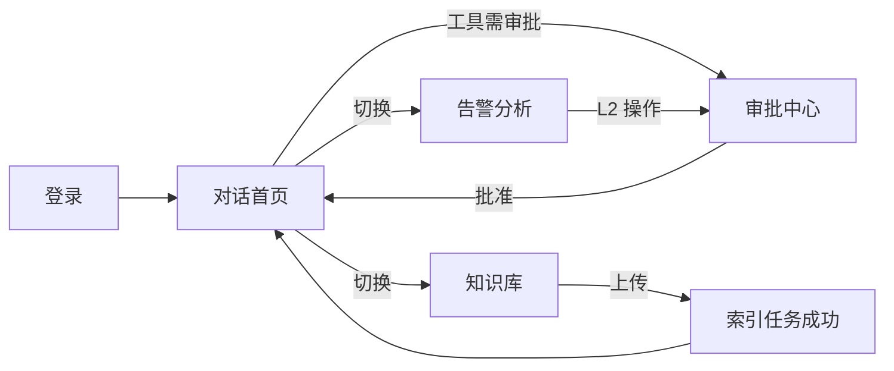

# 智哨（WiseSentinel）Portal — Figma 原型设计规范

> **文档版本**：v1.0  
> **目标**：为 M5 Portal 前端实现提供可落地的 Figma 原型规格  
> **参考产品**：ChatGPT、豆包、通义千问、GitHub Copilot Chat  
> **关联 API**：`/api/v1/*`（详见后端 `api/v1/`）  
> **交互原型**：[`portal-prototype/index.html`](../portal-prototype/index.html)（浏览器打开后可截图导入 Figma）

---

## 1. 设计目标

| 维度 | 说明 |
|------|------|
| **用户** | SRE / OnCall / 研发 / 运维管理员 |
| **心智模型** | 「像 ChatGPT 一样对话，但专为运维场景设计」 |
| **核心路径** | 登录 → 对话问答 → 告警分析 → 知识库上传 → 审批 |
| **差异化** | 工具调用可视化、Runbook 引用、告警报告结构化、RBAC 入口隔离 |

---

## 2. Figma 文件结构（建议）

```
📁 WiseSentinel Portal v1.0
├── 🎨 Cover（封面 + 版本说明）
├── 🧱 Design Tokens（颜色/字体/间距/圆角/阴影）
├── 🧩 Components（组件库）
├── 📐 Layouts（栅格与断点）
├── 🖼️ Pages / Screens
│   ├── 01-Login
│   ├── 02-Chat（默认首页）
│   ├── 03-Ops-Analyze
│   ├── 04-Knowledge
│   ├── 05-Approvals
│   ├── 06-Admin
│   └── 07-Empty-Error-Loading
├── 🔀 Flows（用户流程图）
└── 📱 Responsive（1280 / 768 / 390 断点）
```

**Frame 基准尺寸**

| 断点 | Frame | 说明 |
|------|-------|------|
| Desktop | 1440 × 900 | 主设计稿 |
| Tablet | 1024 × 768 | 侧栏可折叠 |
| Mobile | 390 × 844 | 底部 Tab + 抽屉侧栏 |

---

## 3. Design Tokens

### 3.1 色彩（Light 主题为主，Dark 侧栏）

| Token | 值 | 用途 |
|-------|-----|------|
| `color/brand/primary` | `#2563EB` | 主按钮、链接、选中态 |
| `color/brand/primary-hover` | `#1D4ED8` | 主按钮 Hover |
| `color/brand/accent` | `#06B6D4` | Logo 点缀、「哨」元素 |
| `color/bg/page` | `#F8FAFC` | 页面背景 |
| `color/bg/surface` | `#FFFFFF` | 卡片、输入区 |
| `color/bg/sidebar` | `#0F172A` | 左侧导航（类 ChatGPT Dark Sidebar） |
| `color/bg/sidebar-hover` | `#1E293B` | 侧栏项 Hover |
| `color/text/primary` | `#0F172A` | 主文字 |
| `color/text/secondary` | `#64748B` | 次要说明 |
| `color/text/inverse` | `#F8FAFC` | 侧栏文字 |
| `color/border/default` | `#E2E8F0` | 分割线 |
| `color/status/success` | `#10B981` | 索引成功、任务完成 |
| `color/status/warning` | `#F59E0B` | 待审批、告警 |
| `color/status/error` | `#EF4444` | 失败、Firing 告警 |
| `color/status/info` | `#3B82F6` | 工具调用中 |

### 3.2 字体

| Token | 字体 | 字号 | 行高 | 用途 |
|-------|------|------|------|------|
| `font/display` | PingFang SC / Inter | 24px | 32px | 页面标题 |
| `font/body` | PingFang SC / Inter | 14px | 22px | 正文 |
| `font/caption` | PingFang SC / Inter | 12px | 18px | 辅助信息 |
| `font/code` | JetBrains Mono | 13px | 20px | 日志、JSON、命令 |

### 3.3 间距与圆角

| Token | 值 |
|-------|-----|
| `space/xs` ~ `space/2xl` | 4 / 8 / 12 / 16 / 24 / 32 px |
| `radius/sm` ~ `radius/xl` | 6 / 8 / 12 / 16 px |
| `shadow/card` | 0 1px 3px rgba(15,23,42,0.08) |
| `shadow/popover` | 0 8px 24px rgba(15,23,42,0.12) |

---

## 4. 信息架构（IA）

```
智哨 Portal
├── 对话          /chat              → POST /chat/stream, GET /sessions
├── 告警分析      /ops               → POST /ops/analyze, GET /ops/tasks/{id}
├── 知识库        /knowledge         → upload, list, delete, index-tasks
├── 审批中心      /approvals         → GET /approvals, POST decision
└── 管理          /admin             → agent-configs（sre_admin+）
    └── 设置      /settings          → 租户、主题、退出
```

**侧栏底部**：用户头像 + 角色 Badge + 租户 `default`

---

## 5. 页面规格（Figma Frames）

### 5.1 登录页 `01-Login / 1440`

**布局**：居中卡片（420px 宽）

| 元素 | 规格 |
|------|------|
| Logo | 智哨图标 + 「WiseSentinel」 |
| Slogan | 智守每一声告警，哨护每一次变更 |
| 表单 | 用户名、密码（Phase 1 开发登录） |
| 主按钮 | 「登录」→ `POST /api/v1/auth/token` |
| 次要 | SSO 占位（灰态 Disabled，标注 Phase 2） |

**状态帧**：Default / Loading / Error（401）

---

### 5.2 对话页 `02-Chat / 1440`（默认首页，参考 ChatGPT）

**三区布局**：

```
┌──────────────┬─────────────────────────────────────────────┐
│ 侧栏 260px   │  顶栏：会话标题 + Agent: Chat ▾ + Trace ID  │
│              ├─────────────────────────────────────────────┤
│ + 新对话     │                                             │
│ 会话列表     │           消息流（居中 max-width 768px）       │
│ · 服务下线…  │   [User] 服务下线怎么处理？                    │
│ · K8s Pod…   │   [AI] 根据 Runbook… + 引用卡片              │
│              │   [Tool] query_internal_docs ✓ 1.2s          │
│ ─────────    │                                             │
│ 知识库       ├─────────────────────────────────────────────┤
│ 告警分析     │  输入框 + 📎 + RAG开关 + 工具开关 + 发送        │
│ 审批(3)      │  「Enter 发送 · Shift+Enter 换行」              │
└──────────────┴─────────────────────────────────────────────┘
```

**消息类型组件（Auto Layout 垂直栈）**

| 组件 | 说明 |
|------|------|
| `Message/User` | 右对齐，浅蓝底 `#EFF6FF`，圆角 12px |
| `Message/Assistant` | 左对齐，白底 + 边框，支持 Markdown |
| `Message/Citation` | 引用条：文档名 + snippet + doc_id 链接 |
| `Message/ToolCall` | 折叠条：工具名、状态、耗时；展开 JSON |
| `Message/Streaming` | 光标闪烁 + 逐字占位 |

**空状态**：居中欢迎 + 3 个快捷 Prompt Chip
- 「服务下线告警怎么处理？」
- 「帮我查一下当前 firing 的告警」
- 「Pod CrashLoopBackOff 怎么排查？」

**API 映射**

| 交互 | API |
|------|-----|
| 新对话 | `POST /sessions` |
| 加载历史 | `GET /sessions`, `GET /sessions/{id}/messages` |
| 发送 | `POST /chat/stream`（SSE） |
| 选项 | `options.enable_rag`, `options.enable_tools` |

---

### 5.3 告警分析页 `03-Ops / 1440`

**布局**：左侧输入面板（360px）+ 右侧报告区

**左侧**
- 多行 Query 输入（可空，使用默认 Ops Prompt）
- 选项：同步/异步、MaxIterations 滑块
- 主按钮「开始分析」→ `POST /ops/analyze`

**右侧报告区（类 Copilot 结构化输出）**
1. **摘要卡片**：状态 Badge + trace_id
2. **步骤时间线**（`detail[]` 逐步展开）
3. **完整报告**（Markdown 渲染）
4. **工具调用明细** Tab

**状态帧**：Idle / Running（骨架屏+步骤动画）/ Success / Failed / AwaitingApproval

---

### 5.4 知识库页 `04-Knowledge / 1440`（M2 已就绪）

**布局**：顶栏操作 + 表格列表

| 区域 | 内容 |
|------|------|
| 顶栏 | 「上传文档」按钮 + 拖拽 Upload Zone |
| 表格列 | 名称 / 状态 / 可见性 / 更新时间 / 操作 |
| 行操作 | 查看索引任务 / 删除 |
| 上传弹窗 | file + visibility + secret_level |

**状态 Badge**
- `pending` 灰 | `running` 蓝 | `success` 绿 | `failed` 红

**API**：`POST .../upload`, `GET .../documents`, `DELETE .../documents/{id}`, `GET .../index-tasks/{id}`

---

### 5.5 审批中心 `05-Approvals / 1440`

**布局**：Kanban 或 Table（Phase 1 用 Table）

| 列 | 说明 |
|----|------|
| 类型 | tool_invoke / ops_remediation |
| 关联任务 | task_id 链接 |
| 过期时间 | 倒计时 |
| 操作 | 批准 / 拒绝 + Comment 弹窗 |

---

### 5.6 管理页 `06-Admin / 1440`

- Agent 配置版本列表（chat / ops Tab）
- 激活按钮 → `PUT /admin/agent-configs/{version}/activate`
- 仅 `sre_admin` / `platform_admin` 可见

---

## 6. 组件库清单（Figma Components）

| 组件名 | Variants | 说明 |
|--------|----------|------|
| `Button/Primary` | Default, Hover, Disabled, Loading | |
| `Button/Ghost` | — | 侧栏次要操作 |
| `Input/Text` | Default, Focus, Error | |
| `Input/Chat` | Empty, Focus, Disabled | 多行自适应 |
| `Sidebar/Item` | Default, Active, Hover | 带 Icon |
| `Badge/Status` | success, warning, error, info | |
| `Card/Citation` | — | RAG 引用 |
| `Card/ToolCall` | collapsed, expanded | |
| `Table/Row` | default, hover | 知识库 |
| `Modal/Upload` | — | 文档上传 |
| `Toast` | success, error, info | |
| `Avatar/User` | sm, md | 含角色角标 |

**Icon 建议**：Lucide Icons 或 Phosphor（Figma 社区插件可导入）

| 功能 | Icon |
|------|------|
| 对话 | MessageSquare |
| 告警 | Siren |
| 知识库 | BookOpen |
| 审批 | ShieldCheck |
| 管理 | Settings |
| 工具 | Wrench |
| 引用 | Link |

---

## 7. 关键用户流程（Figma Flow 连线）



---

## 8. 与 ChatGPT / 豆包的对照

| 模式 | ChatGPT / 豆包 | 智哨 Portal |
|------|----------------|-------------|
| 导航 | 左栏会话列表 | ✅ 同构 + 运维模块入口 |
| 对话 | 流式 Markdown | ✅ + ToolCall + Citation |
| 输入 | 底部固定 | ✅ + RAG/工具 Toggle |
| 首页 | 空白 + 建议 | ✅ 运维场景 Prompt Chip |
| 多模态 | 图片/文件 | Phase 1 仅知识库上传，对话 📎 占位 |
| 差异 | 通用助手 | **告警报告时间线、审批流、Runbook 引用** |

---

## 9. 导入 Figma 操作指南

### 方式 A：HTML 原型截图（最快）

1. 浏览器打开 `portal-prototype/index.html`
2. 使用 Figma 插件 **html.to.design** 或手动截图各 Tab 页面
3. 按本文档 Frame 命名规范重命名 Layer

### 方式 B：Design Tokens 插件

1. 在 Figma 创建 Variables Collection：`WiseSentinel`
2. 按 §3 录入 Color / Number / String tokens
3. 绑定到组件 Variants

### 方式 C：从组件库搭建

1. 先建 §6 组件 → 再拼 §5 页面
2. 使用 Auto Layout + 8px 网格
3. Prototype 连线：侧栏 → 页面切换（Smart Animate 200ms ease）

---

## 10. 前端实现建议（M5 预览）

| 项 | 建议 |
|----|------|
| 框架 | React 18 + TypeScript + Vite |
| UI 库 | Ant Design 5 或 shadcn/ui（与 Token 对齐） |
| 状态 | TanStack Query（API 缓存）+ Zustand（UI 状态） |
| 流式 | EventSource / fetch SSE 消费 `/chat/stream` |
| 路由 | `/login`, `/chat`, `/ops`, `/knowledge`, `/approvals`, `/admin` |
| 鉴权 | JWT 存 httpOnly cookie 或 memory + Authorization Header |

---

## 11. Frame 交付 Checklist

- [ ] 01-Login（3 states）
- [ ] 02-Chat-Empty
- [ ] 02-Chat-Conversation（含 Tool + Citation）
- [ ] 02-Chat-Streaming
- [ ] 03-Ops-Idle / Running / Success
- [ ] 04-Knowledge-List / Upload-Modal
- [ ] 05-Approvals-List / Decision-Modal
- [ ] 06-Admin-Configs
- [ ] 07-404 / 403 / 500
- [ ] Mobile-Chat / Mobile-Nav-Drawer

---

## 12. Dark Mode 规格（Phase 2 可选）

| Token | Light | Dark |
|-------|-------|------|
| `color/bg/page` | `#F8FAFC` | `#0B1220` |
| `color/bg/surface` | `#FFFFFF` | `#1E293B` |
| `color/text/primary` | `#0F172A` | `#F1F5F9` |
| `color/border/default` | `#E2E8F0` | `#334155` |
| 侧栏 | 始终深色 `#0F172A` | 同左 |

**切换位置**：设置页 / 顶栏 Toggle · React 实现见 `portal/src/theme/tokens.ts`

---

## 13. 移动端 Frame 规格（390 × 844）

| 区域 | 行为 |
|------|------|
| 导航 | 汉堡菜单 → 左侧 Drawer（260px） |
| 对话 | 全宽消息流，输入框 sticky 底部 |
| 知识库 | 表格 → 卡片列表 |
| Ops | 上下堆叠：先表单，后报告 |
| Tab（可选） | 对话 / 告警 / 知识 / 我的 |

Figma Frame：`Mobile-Chat`, `Mobile-Knowledge`, `Mobile-Nav-Drawer`

---

## 附录 A：API ↔ UI 字段映射

| UI 元素 | Response 字段 |
|---------|---------------|
| 引用卡片 | `citations[].source`, `snippet`, `doc_id` |
| 工具条 | `tool_calls[].tool`, `status`, `latency_ms` |
| Ops 步骤 | `detail[]` |
| 知识库状态 | `status`, `chunk_count` |
| Trace 调试 | `trace_id`（顶栏 Copy 按钮） |

---

*配套交互原型：[`portal-prototype/index.html`](../portal-prototype/index.html)*
