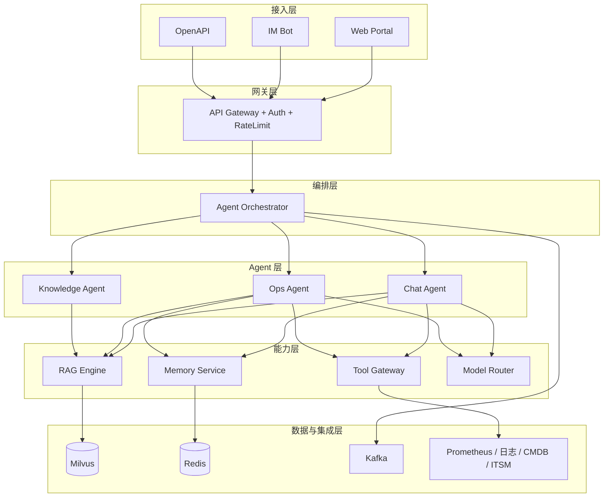
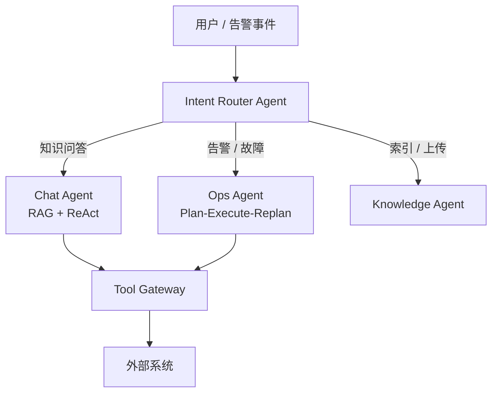
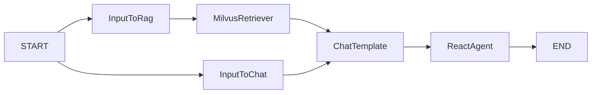
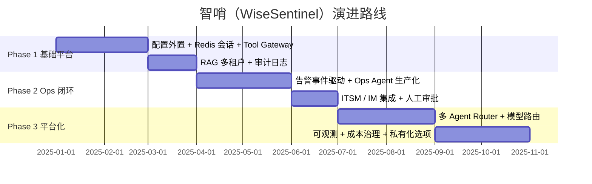

# 智哨（WiseSentinel）企业级智能运维 Agent 平台 — 概要设计

> **文档版本**：v1.0  
> **产品名称**：智哨智能运维平台 / WiseSentinel AI Ops Platform  
> **文档性质**：概要设计（High-Level Design）  
> **参考来源**：Demo 实践经验  
> **最后更新**：2025-06

---

## 目录

- [1. 设计背景与目标](#1-设计背景与目标)
- [2. 业务场景与角色](#2-业务场景与角色)
- [3. 总体架构](#3-总体架构)
- [4. Agent 架构设计](#4-agent-架构设计)
- [5. RAG 与知识库设计](#5-rag-与知识库设计)
- [6. 技术选型建议](#6-技术选型建议)
- [7. 集成与事件驱动](#7-集成与事件驱动)
- [8. 安全、合规与治理](#8-安全合规与治理)
- [9. 可观测与 SLA](#9-可观测与-sla)
- [10. 非功能需求](#10-非功能需求)
- [11. 实施路线](#11-实施路线)
- [12. 命名规范与模块划分](#12-命名规范与模块划分)
- [13. 概要设计结论](#13-概要设计结论)

---

## 1. 设计背景与目标

### 1.1 项目定位

**智哨（WiseSentinel）** 是面向企业级生产环境的智能运维 Agent 平台，具备多租户、治理、可观测、高可用等企业级能力。

| 维度 | 说明 |
|------|------|
| **中文品牌** | 智哨 — 「智」= AI 智能推理，「哨」= OnCall 值守、告警守望 |
| **英文品牌** | WiseSentinel AI Ops Platform |
| **业务场景** | 告警分析、故障诊断、Runbook 执行辅助、知识检索、变更辅助 |
| **典型用户** | SRE、OnCall 工程师、研发、运维管理员 |
| **核心能力** | RAG 检索增强 + ReAct 工具调用 + Plan-Execute-Replan 多步推理 |

**产品 Slogan（可选）**：*智守每一声告警，哨护每一次变更*

### 1.2 Demo 现状与差距分析

Demo 已验证三条核心路径：

| 能力 | Demo 实现 | 企业级差距 |
|------|-----------|------------|
| RAG 知识问答 | Milvus + Markdown 分块 | 缺多租户、权限、版本、审计 |
| ReAct 工具调用 | MCP 日志 + 自研 Tool | 缺统一工具网关、鉴权、限流 |
| Plan-Execute-Replan | AI Ops 告警分析 | 缺人工审批、可观测、失败恢复 |

**Demo 典型问题（需在智哨中消除）**：

- 配置与 Milvus 地址硬编码
- 会话存储于进程内存，重启丢失、多实例不共享
- 无 RBAC、无全链路审计
- Prometheus 工具未真正接入生产
- MySQL 工具依赖 stdin 人工确认，不适合 API 自动化
- API Key 明文写入配置文件

### 1.3 设计目标

| 维度 | 目标 |
|------|------|
| **业务** | 覆盖告警分析、故障诊断、Runbook 执行、知识检索、变更辅助 |
| **技术** | 主流 Agent 框架 + 微服务 + 可插拔工具 + 向量/RAG 平台 |
| **兼容** | 保留 Eino Graph / ReAct / Plan-Execute 模式，平滑迁移 Demo |
| **治理** | 多租户、RBAC、审计、Prompt/Tool 版本管理、人工审批 |
| **运维** | 可观测、高可用、灰度、成本可控 |

---

## 2. 业务场景与角色

### 2.1 核心场景（优先级）

#### P0 — 必做

| 场景 | 说明 |
|------|------|
| 告警智能分析 | 拉取活跃告警，关联 Runbook，输出结构化分析报告 |
| Runbook 知识检索 | 基于 RAG 的内部 SOP / 告警处理手册问答 |
| 日志/指标关联诊断 | 通过 Tool Gateway 查询日志、指标，辅助根因定位 |

#### P1 — 扩展

| 场景 | 说明 |
|------|------|
| 变更前风险评估 | 结合 CMDB、变更记录给出影响面分析 |
| 工单自动草稿 | 生成 ITSM 工单内容，人工确认后提交 |
| 值班交接摘要 | 汇总时段内告警、处理记录 |

#### P2 — 进阶

| 场景 | 说明 |
|------|------|
| 半自动 Remediation | 经审批后执行预定义修复脚本（L2 操作） |
| 根因报告生成 | 跨系统数据聚合，输出 RCA 报告 |
| 容量/成本洞察 | 结合监控与资源数据给出建议 |

### 2.2 场景与人机协同

| 场景 | 用户 | Agent 行为 | 人机协同 |
|------|------|------------|----------|
| 告警 OnCall | SRE / 值班 | 拉告警 → 查 Runbook → 查日志/指标 → 出报告 | 只读分析，不自动改生产 |
| 故障诊断 | 研发 / SRE | 多轮追问 + 工具链 | 高风险操作需审批 |
| 知识问答 | 全员 | RAG + 权限过滤 | 纯只读 |
| 变更辅助 | 变更负责人 | 影响面分析 + Checklist | 建议型，不执行变更 |

### 2.3 角色与权限

| 角色 | 能力边界 |
|------|----------|
| **只读用户** | 知识检索、告警只读分析 |
| **运维工程师** | + 日志/指标查询、Runbook 执行建议 |
| **SRE Admin** | + 工具配置、Prompt 发布、审批流 |
| **平台管理员** | 租户、模型、密钥、审计 |

---

## 3. 总体架构

### 3.1 逻辑分层（六层架构）

```
┌─────────────────────────────────────────────────────────────────────────┐
│  接入层：Web Portal / IM Bot(企微/钉钉/Slack) / API / OpenAPI           │
├─────────────────────────────────────────────────────────────────────────┤
│  网关层：API Gateway + 认证(JWT/OAuth2) + 限流 + 租户路由              │
├─────────────────────────────────────────────────────────────────────────┤
│  编排层：Agent Orchestrator（会话、路由、Agent 选择、人机审批）         │
├─────────────────────────────────────────────────────────────────────────┤
│  Agent 层：Chat Agent / Ops Agent / Knowledge Agent / 自定义 Agent     │
│           （Eino Graph + ReAct + Plan-Execute-Replan）                   │
├─────────────────────────────────────────────────────────────────────────┤
│  能力层：RAG Engine | Tool Gateway | Memory | Model Router | Workflow   │
├─────────────────────────────────────────────────────────────────────────┤
│  集成层：Prometheus/Alertmanager | ELK/CLS | CMDB | ITSM | K8s API ...  │
├─────────────────────────────────────────────────────────────────────────┤
│  数据层：Milvus/PGVector | Redis | MySQL/PG | OSS | Kafka               │
└─────────────────────────────────────────────────────────────────────────┘
```

### 3.2 架构示意图



### 3.3 与 Demo 的映射

| Demo 模块 | 智哨企业级对应 |
|-----------|----------------|
| `chat_pipeline` | **Chat Agent Service**（通用对话 + RAG + ReAct） |
| `plan_execute_replan` | **Ops Agent Service**（Plan-Execute-Replan + 审批） |
| `knowledge_index_pipeline` | **Knowledge Index Service**（异步索引任务） |
| `internal/ai/tools/*` | **Tool Gateway** 统一注册与调用 |
| `utility/mem` | **Session/Memory Service**（Redis + 长期记忆可选） |
| GoFrame 单体 | **微服务拆分** 或 **模块化单体**（按团队规模选型） |

**兼容策略**：保留 Eino Graph 定义方式，将 `BuildChatAgent` / `BuildPlanAgent` 封装为可配置模板，通过配置中心切换 Prompt、工具集、模型。

---

## 4. Agent 架构设计

### 4.1 多 Agent 协作模型

企业场景不宜单一 Agent 包打天下，建议采用 **Router + Specialist** 模式：



| Agent 类型 | 框架模式 | 适用场景 |
|------------|----------|----------|
| **Chat Agent** | Eino Graph（RAG 并行 + ReAct） | 日常问答、轻量诊断 |
| **Ops Agent** | Eino ADK Plan-Execute-Replan | 多步告警分析、复杂 Runbook |
| **Knowledge Agent** | Eino Graph（Loader → Split → Index） | 文档入库、增量更新 |
| **Router** | 规则 + 小模型分类 | 意图路由、Agent 选择 |

### 4.2 Chat Agent 流水线（继承 Demo）

基于 Eino Graph Compose 的有向图编排：



| 节点 | 作用 |
|------|------|
| `InputToRag` | 提取用户 query，供 RAG 检索 |
| `InputToChat` | 组装 content、history、date 等 Prompt 变量 |
| `MilvusRetriever` | 向量检索，输出 documents |
| `ChatTemplate` | 拼接 System Prompt + 历史 + RAG 文档 |
| `ReactAgent` | ReAct Agent，调用 Tool Gateway 注册的工具 |

**触发模式**：`AllPredecessor` — ChatTemplate 需等 RAG 与会话分支均完成后再执行。

### 4.3 Ops Agent 流水线（继承 Demo）

Plan-Execute-Replan 模式，用于告警自动分析：

```
Planner (DeepSeek Think)
    → Executor (DeepSeek Quick + Tools)
    → Replanner (DeepSeek Think)
    → [循环，MaxIterations 可配置]
```

### 4.4 Tool Gateway 企业化设计

| 能力 | Demo 实现 | 智哨设计 |
|------|-----------|----------|
| 日志 | 腾讯云 MCP SSE | 多后端适配（CLS / ELK / Loki），MCP + REST 双协议 |
| 告警 | Prometheus HTTP（未完整接入） | Alertmanager + 多集群联邦 |
| 文档 RAG | 直连 Milvus | 经 RAG Engine，带租户 / 权限过滤 |
| 数据库 | GORM + stdin 确认 | 禁止 Agent 直连；只读 SQL 模板 + 审批 |
| 写操作 | 无 | **Human-in-the-Loop** 审批队列 |

**工具注册规范**：

| 字段 | 说明 |
|------|------|
| 名称 / Schema | 符合 OpenAI Function Calling 规范 |
| 风险等级 | L0 只读 / L1 敏感读 / L2 写操作 |
| 超时 / 熔断 | 防止外部依赖拖垮 Agent |
| 审计字段 | 调用者、租户、入参摘要、结果状态 |

**ReAct / Ops Agent 工具集（参考）**：

- 日志查询（MCP / REST）
- Prometheus / Alertmanager 告警查询
- 内部文档 RAG 检索
- 当前时间
- CMDB 查询（扩展）
- 只读 K8s Event / Pod 状态（扩展）

### 4.5 记忆与会话

| 层级 | 存储 | 用途 |
|------|------|------|
| **短期** | Redis（TTL） | 当前会话窗口（替代 Demo 内存 Map） |
| **中期** | MySQL / PostgreSQL | 会话元数据、消息摘要 |
| **长期** | 向量库 / 图数据库（可选） | 历史故障案例、Runbook 执行记录 |

Demo 的滑动窗口策略（如 MaxWindowSize=6）可保留为可配置参数，企业侧增加 **摘要压缩** 以控制 Token 成本。

---

## 5. RAG 与知识库设计

### 5.1 知识体系

```
企业知识库
├── Runbook（告警处理手册、SOP）
├── 架构文档 / ADR
├── 历史 Incident 报告
├── CMDB 元数据（服务、依赖、负责人）
└── 变更记录 / 发布说明
```

### 5.2 索引流水线

在 Demo `knowledge_index_pipeline` 基础上增强：

```
文档上传 / OSS / Webhook
    → 解析（Markdown / PDF / Confluence API）
    → 分块（Header / 语义 / 固定窗口 混合策略）
    → 元数据打标（tenant_id、业务线、密级、版本、_source）
    → Embedding（多模型路由）
    → 向量库（Milvus 多 Collection 或 partition by tenant）
    → 索引任务队列（Kafka + Worker，支持重试）
```

**增量更新策略（继承 Demo）**：按 `metadata["_source"]` 删除旧向量后重新索引，避免重复。

### 5.3 Milvus 数据模型（参考）

| 字段 | 类型 | 说明 |
|------|------|------|
| `id` | VarChar | 主键 |
| `vector` | BinaryVector / FloatVector | 向量字段 |
| `content` | VarChar | 文本内容 |
| `metadata` | JSON | 含 `_source`、`tenant_id`、`visibility` 等 |

### 5.4 检索增强策略

| 策略 | 说明 |
|------|------|
| **混合检索** | 向量 + BM25（Elasticsearch） |
| **重排序** | Cross-Encoder / 小模型 Rerank |
| **权限过滤** | 检索前注入 tenant_id + visibility 条件 |
| **引用溯源** | 回答必须带 doc_id、chunk_id、原文链接 |

### 5.5 RAG 数据流

```
用户问题
    → Embedding
    → Milvus 向量检索 (+ 权限过滤)
    → [可选] Rerank
    → 注入 System Prompt {documents}
    → Agent 生成回答 / 调用工具
```

---

## 6. 技术选型建议

### 6.1 技术栈总览

| 层级 | 推荐方案 | 与 Demo 关系 |
|------|----------|--------------|
| **Agent 编排** | CloudWeGo **Eino**（主） | 直接延续 Demo |
| **备选 / 混合** | LangGraph（Python 栈）、Dify 企业版（低代码） | 通过 API 集成，非替换 |
| **Web / API** | GoFrame v2 或 Gin + 独立 BFF | Demo 可渐进拆分 |
| **向量库** | **Milvus 2.x**（集群模式） | 延续，加 HA |
| **缓存 / 会话** | Redis Cluster | 替代内存 Map |
| **消息队列** | Kafka / RocketMQ | 索引、告警事件、异步 Agent |
| **可观测** | OpenTelemetry + Prometheus + Grafana + Langfuse / Phoenix | 新增 |
| **配置 / 密钥** | Nacos / Apollo + Vault | 替代 yaml 硬编码 |
| **LLM** | 企业模型网关（DeepSeek / 通义 / 混元 多模型路由） | 抽象 Model Router |
| **Embedding** | DashScope text-embedding-v4 等 | 可配置多模型 |

**选型原则**：Agent 核心继续 Eino，降低 Demo 迁移成本；外围用成熟中间件补齐企业能力。

### 6.2 部署形态

| 阶段 | 形态 | 适用 |
|------|------|------|
| **Phase 1** | 模块化单体（Go + Eino + Redis + Milvus） | 小团队、快速验证 |
| **Phase 2** | 核心服务拆分（Orchestrator / Agent / RAG / Tool GW） | 中等规模 |
| **Phase 3** | K8s 多 AZ + 多租户 SaaS 或私有化集群 | 大规模企业 |

### 6.3 基础设施（参考 Demo docker-compose）

| 组件 | 用途 |
|------|------|
| etcd | Milvus 元数据 |
| MinIO | Milvus 对象存储 |
| Milvus Standalone / Cluster | 向量存储与检索 |
| Attu | Milvus 管理 UI |
| Redis | 会话与缓存 |
| Kafka | 异步任务与事件 |

---

## 7. 集成与事件驱动

### 7.1 告警驱动（Ops Agent 主动触发）

```
Alertmanager Webhook
    → Event Bus (Kafka)
    → Ops Agent Worker（Plan-Execute-Replan）
    → 结果写入 ITSM 工单 / IM 推送 / 值班大屏
    → 人工确认 / 升级
```

与 Demo「前端按钮触发 `/api/ai_ops`」相比，企业侧以 **事件驱动 + 工单闭环** 为主路径，UI 为辅。

### 7.2 标准集成清单

| 系统 | 集成方式 | Agent 用途 |
|------|----------|------------|
| Prometheus / Alertmanager | REST / Webhook | 告警拉取、关联 |
| 日志（CLS / ELK / Loki） | MCP 或 REST | 根因分析 |
| CMDB | REST / GraphQL | 影响面、负责人 |
| ITSM（Jira / ServiceNow / 自研） | REST | 工单创建、状态同步 |
| K8s API | 只读 List / Get | Pod / Event 诊断 |
| IM（企微 / 钉钉 / Slack） | Bot Webhook | 值班交互 |

### 7.3 API 设计（参考 Demo 演进）

| 接口 | 方法 | 功能 | 智哨增强 |
|------|------|------|----------|
| `/api/v1/chat` | POST | 同步对话 | + 租户 / 鉴权 / 审计 |
| `/api/v1/chat/stream` | POST | SSE 流式对话 | + Redis 会话 |
| `/api/v1/knowledge/upload` | POST | 文档上传与索引 | + 异步任务 / 权限 |
| `/api/v1/ops/analyze` | POST | 告警分析 | + 审批流 / 工单联动 |
| `/api/v1/webhook/alert` | POST | 告警事件接入 | 新增 |

---

## 8. 安全、合规与治理

| 领域 | 设计要求 |
|------|----------|
| **认证** | SSO（LDAP / OAuth2 / OIDC），API Key 仅用于系统集成 |
| **授权** | RBAC + 资源级（业务线、环境 prod / staging） |
| **数据** | 租户隔离、密级标签、日志脱敏 |
| **Agent 安全** | Prompt 注入防护、Tool 白名单、L2 操作人工审批 |
| **审计** | 全链路：谁、何时、问了什么、调了哪些 Tool、用了哪些文档 |
| **合规** | 模型调用留痕、敏感数据不出域（支持私有化部署） |
| **密钥管理** | Vault / 云 KMS，禁止明文写入配置文件 |

---

## 9. 可观测与 SLA

### 9.1 观测维度

| 指标 | 说明 |
|------|------|
| Agent 成功率 / 平均步数 | ReAct / Plan-Execute 质量 |
| Tool 调用延迟 / 失败率 | 外部依赖健康 |
| RAG 命中率 / 引用率 | 知识库质量 |
| Token 消耗 / 单次成本 | 成本治理 |
| 端到端 P99 延迟 | 用户体验 |

### 9.2 技术栈

| 类型 | 方案 |
|------|------|
| **Tracing** | OpenTelemetry（跨 Agent → Tool → LLM） |
| **LLM 观测** | Langfuse / Arize Phoenix / 自研 Trace Store |
| **指标 / 告警** | Prometheus + Grafana（平台自身也需监控） |

### 9.3 SLA 目标（参考）

| 项 | 目标 |
|----|------|
| 核心 API 可用性 | 99.9% |
| Agent 异步任务 | 可降级、可重试 |
| 流式对话 P99 | < 30s（视模型与工具链而定） |

---

## 10. 非功能需求

| 项 | 目标（参考） |
|----|--------------|
| **可用性** | 核心 API 99.9%，Agent 异步任务可降级 |
| **并发** | 按租户限流，LLM 调用队列削峰 |
| **扩展** | 水平扩展 Orchestrator / Worker，Milvus 分片 |
| **灾备** | 向量库、会话、配置多副本 |
| **版本** | Prompt / Tool / Agent Graph 版本化 + 灰度发布 |
| **兼容性** | 支持 Demo 级 Eino Graph 模板平滑迁移 |

---

## 11. 实施路线

### 11.1 阶段规划



### 11.2 各阶段交付物

| 阶段 | 交付物 | Demo 迁移要点 |
|------|--------|---------------|
| **Phase 1** | 配置中心、Redis 会话、Tool Gateway、基础 RBAC | 保留 `chat_pipeline` 图结构，替换 mem / config |
| **Phase 2** | 告警 Webhook、Ops Agent 生产化、Runbook 版本管理 | 强化 `plan_execute_replan`，补 Prometheus 真实接入 |
| **Phase 3** | 多租户、混合检索、IM Bot、模型路由、全链路 Trace | 前端升级为 Portal，Demo 前端作 PoC 保留 |

---

## 12. 命名规范与模块划分

### 12.1 品牌与仓库

| 项 | 命名 |
|----|------|
| 产品名 | 智哨智能运维平台 |
| 英文名 | WiseSentinel AI Ops Platform |
| 仓库名 | `wisesentinel` 或 `wisesentinel-platform` |
| Slogan | 智守每一声告警，哨护每一次变更 |

### 12.2 服务模块划分

```
wisesentinel-gateway        # 接入与鉴权、限流、租户路由
wisesentinel-orchestrator   # Agent 编排、会话、Router、审批
wisesentinel-agent          # Chat / Ops / Knowledge Agent（Eino）
wisesentinel-rag            # 知识库、索引、检索、Rerank
wisesentinel-toolkit        # Tool Gateway、MCP 适配、外部集成
wisesentinel-portal         # Web 前端（演进自 Demo Frontend）
```

## 13. 概要设计结论

### 13.1 核心结论

1. **Agent 层**：延续 Eino 的 Graph + ReAct + Plan-Execute-Replan，通过 **Router + 多 Specialist Agent** 覆盖企业运维场景。
2. **平台层**：补齐 Tool Gateway、RAG Engine、Session / Memory、Model Router、审批与审计，将 Demo 单体逻辑下沉为可配置服务。
3. **集成层**：以 **事件驱动（告警 → Agent → 工单 / IM）** 为主路径，聊天 UI 为辅。
4. **数据层**：Milvus 多租户 + Redis 会话 + 异步索引队列，替代 Demo 内存与同步索引。
5. **治理层**：RBAC、Tool 风险分级、Human-in-the-Loop、全链路可观测，满足企业合规要求。

### 13.2 设计原则

| 原则 | 说明 |
|------|------|
| **兼容演进** | 自 Demo 平滑迁移，而非推倒重来 |
| **场景驱动** | 以 OnCall / 告警分析为 P0，逐步扩展 |
| **安全默认** | 只读优先，写操作必审批 |
| **可观测内置** | Agent 平台自身必须可监控、可审计 |
| **分阶段落地** | 模块化单体 → 服务拆分 → 平台化 |

---

## 附录 A：Demo 技术栈参考

| 组件 | Demo 使用 |
|------|-----------|
| Web 框架 | GoFrame v2 |
| Agent 框架 | CloudWeGo Eino v0.6 |
| LLM | DeepSeek V3（火山引擎 Ark API） |
| Embedding | 阿里云 DashScope text-embedding-v4 |
| 向量库 | Milvus 2.5 |
| 工具 | MCP（腾讯云日志）、自研 Tool |
| 前端 | Vanilla JS + SSE |

---

## 附录 B：文档修订记录

| 版本 | 日期 | 说明 |
|------|------|------|
| v1.0 | 2025-06 | 初版概要设计，含智哨命名与 Demo 映射 |

---

*本文档为概要设计（HLD）。详细设计（LLD）见：[WiseSentinel-企业级智能运维Agent平台-详细设计.md](./WiseSentinel-企业级智能运维Agent平台-详细设计.md)*
