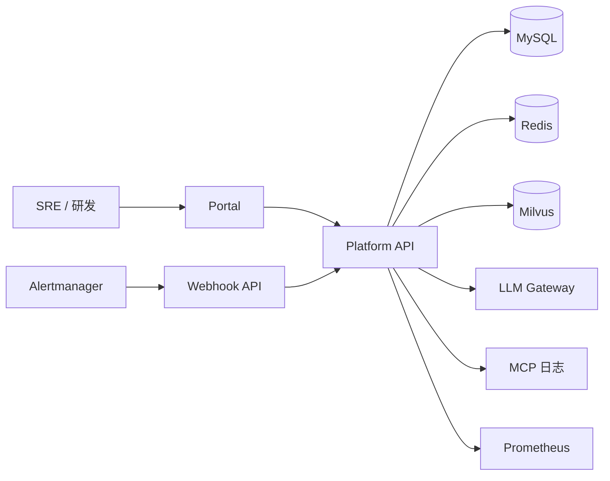
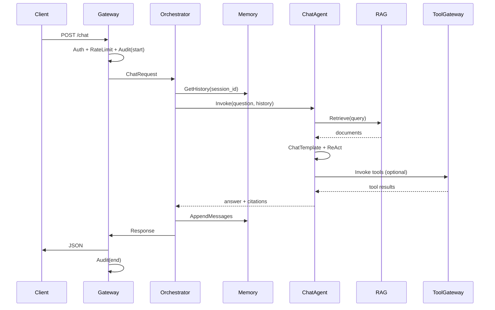

# 智哨（WiseSentinel）企业级智能运维 Agent 平台 — 详细设计

> **文档版本**：v1.1  
> **产品名称**：智哨智能运维平台 / WiseSentinel AI Ops Platform  
> **文档性质**：详细设计（LLD），反映实际实现状态  
> **上游文档**：[概要设计](./WiseSentinel-企业级智能运维Agent平台-概要设计.md)  
> **参考实现**： Demo  
> **最后更新**：2026-07

---

## 文档说明

本文档在概要设计（HLD）基础上展开**可落地的实现规格**，包含：

- 工程结构与模块边界
- 接口契约（REST API + 内部 Service Interface）
- 数据库与缓存设计（DDL / Redis Key / Milvus Schema）
- 核心流程时序与状态机
- 配置项清单与环境变量
- Demo → 智哨迁移对照与 Phase 1 交付清单

**Phase 1 交付范围（本文档实现基准）**：模块化单体部署，单仓库多模块，具备 Chat / Ops / Knowledge 三条 Agent 链路、Tool Gateway、Redis 会话、MySQL 元数据、Milvus RAG、基础 RBAC 与审计。

> **v1.1 更新说明**：本文档已根据实际代码实现进行同步更新。M1（基础框架）、M2（RAG+Knowledge）、M3（Chat Agent）、M4（Ops Agent）四个里程碑已全部完成，M5（Portal 前端）部分完成。实现过程中与原始设计的关键差异已在各章节中以 "⭐" 和 "实现差异" 标注。

---

## 目录

1. [系统边界与部署视图](#1-系统边界与部署视图)
2. [工程结构与模块设计](#2-工程结构与模块设计)
3. [领域模型与数据设计](#3-领域模型与数据设计)
4. [API 详细设计](#4-api-详细设计)
5. [Orchestrator 编排层设计](#5-orchestrator-编排层设计)
6. [Agent 层详细设计](#6-agent-层详细设计)
7. [RAG Engine 详细设计](#7-rag-engine-详细设计)
8. [Tool Gateway 详细设计](#8-tool-gateway-详细设计)
9. [Model Router 详细设计](#9-model-router-详细设计)
10. [Memory 会话服务设计](#10-memory-会话服务设计)
11. [事件驱动与 Ops 任务设计](#11-事件驱动与-ops-任务设计)
12. [安全、RBAC 与审批流设计](#12-安全rbac-与审批流设计)
13. [可观测性设计](#13-可观测性设计)
14. [配置与环境变量](#14-配置与环境变量)
15. [部署与运维](#15-部署与运维)
16. [Demo 迁移指南](#16-demo-迁移指南)
17. [Phase 1 开发任务分解](#17-phase-1-开发任务分解)
18. [测试与验收标准](#18-测试与验收标准)

---

## 1. 系统边界与部署视图

### 1.1 Phase 1 部署拓扑（模块化单体）

Phase 1 采用**单进程 + 多内部模块**，降低团队初期交付成本；模块间通过 Go Interface 隔离，为 Phase 2 拆服务预留边界。

```
                    ┌─────────────────────────────────────┐
                    │         wisesentinel-portal         │
                    │    (静态前端 / Nginx 托管)           │
                    └──────────────────┬──────────────────┘
                                       │ HTTPS
                    ┌──────────────────▼──────────────────┐
                    │      wisesentinel-platform          │
                    │  (GoFrame HTTP :8090, 单二进制)      │
                    │  ┌─────────┬──────────┬───────────┐ │
                    │  │ gateway │orch      │ audit     │ │
                    │  ├─────────┼──────────┼───────────┤ │
                    │  │ agent   │ rag      │ toolkit   │ │
                    │  └─────────┴──────────┴───────────┘ │
                    └──────┬─────────┬─────────┬──────────┘
                           │         │         │
              ┌────────────▼──┐  ┌───▼───┐  ┌──▼────────────┐
              │ MySQL 8.0     │  │ Redis │  │ Milvus 2.5    │
              └───────────────┘  └───────┘  └───────────────┘
                           │
              ┌────────────▼──────────────────────────────┐
              │ 外部：LLM API / MCP 日志 / Prometheus     │
              └─────────────────────────────────────────────┘
```

### 1.2 进程与端口

| 组件 | 进程/容器 | 端口 | 说明 |
|------|-----------|------|------|
| Platform API | `wisesentinel-platform` | 8090 | 主 API + SSE |
| Portal | Nginx 静态 | 80 / 443 | 前端 |
| MySQL | docker / 云 RDS | 3306 | 元数据、审计、任务 |
| Redis | docker / 云 Redis | 6379 | 会话、限流、分布式锁 |
| Milvus | docker-compose | 19530 | 向量库 |
| Kafka（Phase 2） | — | 9092 | 索引/告警异步，Phase 1 可用 DB 任务表替代 |

### 1.3 系统上下文（C4 Container 简图）



---

## 2. 工程结构与模块设计

### 2.1 仓库结构（Monorepo）— 实际目录（v1.1）

```
wisesentinel-platform/
├── cmd/
│   └── platform/
│       └── main.go                 # 入口：初始化 bootstrap + GoFrame HTTP 服务器
├── api/                            # 对外 API 契约（GoFrame 规范路由）
│   └── v1/
│       ├── auth.go                 # 认证接口 POST /auth/token
│       ├── chat.go                 # 同步/流式对话 POST /chat, /chat/stream
│       ├── knowledge.go            # 知识库文档 CRUD + 索引
│       ├── ops.go                  # Ops 分析 + Webhook
│       ├── session.go              # 会话管理
│       ├── admin.go                # Agent 配置 + 审批流
│       └── ping.go                 # 连通性检查 GET /ping
├── internal/
│   ├── bootstrap/                  # ⭐ 应用初始化（新增）
│   │   ├── bootstrap.go            # Init(): 组装所有服务依赖
│   │   └── envconfig.go            # 环境变量覆盖 YAML 配置
│   ├── gateway/                    # HTTP 路由、鉴权、限流、统一响应
│   │   ├── middleware/
│   │   │   ├── common.go           # Recovery / Trace / CORS / Tenant / UnifiedResponse / RequestLogger
│   │   │   └── security.go         # Auth (JWT/API Key) / RBAC / RateLimit / Audit
│   │   ├── auth/
│   │   │   └── jwt.go              # JWT 签发与解析（HS256）
│   │   ├── metrics/
│   │   │   ├── metrics.go          # Prometheus 注册
│   │   │   └── http.go             # HTTP 请求指标
│   │   ├── handler/
│   │   │   ├── controller.go       # V1 控制器（Auth/Session/Chat/Ops/Approval/Admin）
│   │   │   ├── knowledge.go        # 知识库 Handler（Upload/List/Delete/GetIndexTask）
│   │   │   └── health.go           # 健康检查 /health/live, /health/ready
│   │   └── router.go               # 路由注册 + 中间件链
│   ├── orchestrator/               # 编排：Router、任务调度
│   │   ├── router/
│   │   │   └── router.go           # IntentRouter 实现（规则路由）
│   │   └── task/
│   │       └── ops_worker.go       # Ops 异步任务 Worker（DB 轮询 + Redis 分布式锁）
│   ├── agent/                      # Eino Agent 实现
│   │   ├── chat/
│   │   │   ├── agent.go            # ⭐ ReAct Agent（已实现，M3）
│   │   │   └── doc.go              # 包说明
│   │   ├── ops/
│   │   │   ├── agent.go            # ⭐ Plan-Execute-Replan Agent（已实现，M4）
│   │   │   ├── planner.go          # Planner（ops_plan 模型）
│   │   │   ├── executor.go         # Executor（ops_exec 模型 + 工具）
│   │   │   └── replanner.go        # Replanner（ops_plan 模型）
│   │   └── knowledge/
│   │       ├── pipeline.go         # IndexDocument 入口（先删后建）
│   │       ├── graph.go            # Eino Chain: FileLoader→MarkdownSplitter→MilvusIndexer
│   │       ├── file_loader.go      # Eino 文件加载 Lambda
│   │       ├── markdown_transformer.go # Eino MarkdownTransformer
│   │       ├── eino_indexer.go     # Eino → Milvus Indexer 适配
│   │       ├── context.go          # Context 中传递 IndexTask 元数据
│   │       ├── graph_test.go       # Graph 编译测试
│   │       └── doc.go
│   ├── rag/                        # 检索、索引引擎
│   │   ├── service.go              # RAGService 实现
│   │   ├── client/milvus.go        # Milvus 客户端（配置化地址 + 自动初始化）
│   │   ├── embedder/
│   │   │   ├── embedder.go         # Embedder 接口
│   │   │   ├── dashscope.go        # DashScope text-embedding-v4
│   │   │   ├── factory.go          # 工厂（API Key 存在时用 DashScope，否则 HashEmbedder）
│   │   │   └── hash.go             # HashEmbedder（开发/测试用）
│   │   ├── indexer/milvus.go       # Milvus Indexer（Embed → Insert → Flush）
│   │   ├── retriever/milvus.go     # Milvus Retriever（向量搜索 + 租户过滤）
│   │   ├── splitter/
│   │   │   ├── markdown.go         # Markdown 分块器
│   │   │   └── markdown_test.go
│   │   ├── filter/
│   │   │   ├── filter.go           # Milvus 过滤表达式构建
│   │   │   └── filter_test.go
│   │   └── rag_integration_test.go # 集成测试（Milvus, tag=integration）
│   ├── toolkit/                    # Tool Gateway
│   │   ├── gateway.go              # ToolGateway 实现（注册、路由、Invoke）
│   │   ├── eino_tools.go           # Eino 工具适配（AsEinoTools → tool.BaseTool）
│   │   └── adapters/
│   │       ├── current_time.go     # 获取当前时间（L0）
│   │       ├── prometheus.go       # 查询 Prometheus 告警（L0）
│   │       ├── query_internal_docs.go  # 查询内部文档（L0，调用 RAGService）
│   │       └── query_logs.go       # MCP 日志查询（L1）
│   ├── model/
│   │   └── router.go               # ⭐ ModelRouter 实现（配置化 profile → OpenAI 兼容客户端）
│   ├── memory/
│   │   └── redis_store.go          # ⭐ SessionService 实现（Redis List + MySQL 元数据）
│   ├── domain/                     # 领域实体、枚举、接口
│   │   ├── service.go              # 核心接口 + 数据模型
│   │   ├── enums.go                # 枚举：AgentType / ToolRiskLevel / Role / 任务状态
│   │   ├── access.go               # 权限工具
│   │   └── access_test.go
│   ├── repository/                 # MySQL DAO
│   │   ├── document.go             # ws_document CRUD
│   │   ├── index_task.go           # ws_index_task CRUD
│   │   ├── session.go              # ws_session CRUD
│   │   └── ops_task.go             # ws_ops_task CRUD + ListPending + ListByTenant
│   └── pkg/                        # 公共工具
│       ├── configx/env.go          # 环境变量优先配置读取
│       ├── ctxkeys/keys.go         # Context Key 存取
│       ├── response/response.go    # 统一响应体
│       ├── apperr/codes.go         # 业务错误码
│       ├── trace/trace.go          # UUID Trace ID
│       └── storage/local.go        # 本地文件存储
├── manifest/
│   ├── config/config.yaml          # 主配置文件
│   ├── docker/
│   │   ├── docker-compose.yml      # MySQL + Redis + Milvus + Platform
│   │   └── Dockerfile              # 多阶段构建
│   └── sql/schema.sql              # 10 张表 DDL + 种子数据
├── portal/                         # ⭐ 前端 SPA（React 18 + Ant Design 5 + Vite 6）
│   ├── src/
│   │   ├── main.tsx                # 入口
│   │   ├── App.tsx                 # 路由配置
│   │   ├── api/client.ts           # API 客户端 + JWT
│   │   ├── api/types.ts            # TypeScript 类型
│   │   ├── context/AuthContext.tsx  # 认证上下文
│   │   ├── theme/tokens.ts         # 设计 Token
│   │   ├── layouts/AppLayout.tsx   # 应用布局（侧栏+内容）
│   │   ├── pages/
│   │   │   ├── Login.tsx           # 登录页（已对接 API）
│   │   │   ├── Chat.tsx            # 对话页（UI 原型）
│   │   │   ├── Ops.tsx             # 告警分析页（UI 原型）
│   │   │   ├── Knowledge.tsx       # 知识库页（已对接 API）⭐
│   │   │   ├── Approvals.tsx       # 审批页（UI 原型）
│   │   │   └── Admin.tsx           # 配置管理页（UI 原型）
│   │   └── styles/global.css
│   └── vite.config.ts
├── portal-prototype/               # 高保真 HTML 原型（6 页面）
├── testdata/knowledge/             # 测试文档
├── docs/                           # 设计文档
├── .env.example                    # 环境变量模板
├── go.mod / go.sum
└── README.md
```

### 2.2 模块依赖规则

```
gateway → orchestrator → agent / rag / toolkit / memory / model
agent   → rag, toolkit, model, memory
rag     → model (embedder), Milvus client
toolkit → 外部系统, rag (internal_docs)
orchestrator → repository, memory
```

**禁止**：`toolkit` 不得直接依赖 `agent`；`rag` 不得依赖 `agent`（避免循环依赖）。

### 2.3 核心 Interface 定义

开发前先落地以下接口（`internal/domain/service.go` 或分包定义）：

```go
// SessionService 会话读写
type SessionService interface {
    GetHistory(ctx context.Context, tenantID, sessionID string) ([]*schema.Message, error)
    AppendMessages(ctx context.Context, tenantID, sessionID string, msgs ...*schema.Message) error
    CreateSession(ctx context.Context, tenantID, userID string) (sessionID string, err error)
}

// RAGService 检索与索引
type RAGService interface {
    Retrieve(ctx context.Context, req *RetrieveRequest) (*RetrieveResponse, error)
    SubmitIndexTask(ctx context.Context, req *IndexTaskRequest) (taskID string, err error)
    GetIndexTask(ctx context.Context, tenantID, taskID string) (*IndexTask, error)
}

// ToolGateway 工具调用
type ToolGateway interface {
    ListTools(ctx context.Context, tenantID string, agentType AgentType) ([]ToolMeta, error)
    Invoke(ctx context.Context, req *ToolInvokeRequest) (*ToolInvokeResponse, error)
}

// ModelRouter LLM/Embedding 路由
type ModelRouter interface {
    ChatModel(ctx context.Context, profile ModelProfile) (model.ToolCallingChatModel, error)
    Embedder(ctx context.Context, profile ModelProfile) (embedding.Embedder, error)
}

// AgentRunner Agent 执行
type AgentRunner interface {
    ChatInvoke(ctx context.Context, req *ChatAgentRequest) (*ChatAgentResponse, error)
    ChatStream(ctx context.Context, req *ChatAgentRequest) (StreamReader, error)
    OpsAnalyze(ctx context.Context, req *OpsAgentRequest) (*OpsAgentResponse, error)
}

// IntentRouter 意图路由
type IntentRouter interface {
    Route(ctx context.Context, req *RouteRequest) (AgentType, error)
}
```

---

## 3. 领域模型与数据设计

### 3.1 枚举与常量

```go
// TenantID 多租户标识，Phase 1 默认 "default"
// AgentType: chat | ops | knowledge
// ToolRiskLevel: L0_READONLY | L1_SENSITIVE_READ | L2_WRITE
// IndexTaskStatus: pending | running | success | failed
// OpsTaskStatus: pending | running | success | failed | awaiting_approval
// ApprovalStatus: pending | approved | rejected | expired
```

### 3.2 MySQL DDL

文件：`manifest/sql/schema.sql`

```sql
-- 租户
CREATE TABLE ws_tenant (
    id            BIGINT PRIMARY KEY AUTO_INCREMENT,
    tenant_id     VARCHAR(64)  NOT NULL UNIQUE COMMENT '业务租户ID',
    name          VARCHAR(128) NOT NULL,
    status        TINYINT      NOT NULL DEFAULT 1 COMMENT '1=active 0=disabled',
    created_at    DATETIME     NOT NULL DEFAULT CURRENT_TIMESTAMP,
    updated_at    DATETIME     NOT NULL DEFAULT CURRENT_TIMESTAMP ON UPDATE CURRENT_TIMESTAMP
) ENGINE=InnoDB DEFAULT CHARSET=utf8mb4;

-- 用户（Phase 1 可对接外部 SSO，本地存映射）
CREATE TABLE ws_user (
    id            BIGINT PRIMARY KEY AUTO_INCREMENT,
    tenant_id     VARCHAR(64)  NOT NULL,
    user_id       VARCHAR(64)  NOT NULL COMMENT 'SSO sub 或本地ID',
    display_name  VARCHAR(128) NOT NULL DEFAULT '',
    email         VARCHAR(256) NOT NULL DEFAULT '',
    status        TINYINT      NOT NULL DEFAULT 1,
    created_at    DATETIME     NOT NULL DEFAULT CURRENT_TIMESTAMP,
    updated_at    DATETIME     NOT NULL DEFAULT CURRENT_TIMESTAMP ON UPDATE CURRENT_TIMESTAMP,
    UNIQUE KEY uk_tenant_user (tenant_id, user_id)
) ENGINE=InnoDB DEFAULT CHARSET=utf8mb4;

-- 角色绑定
CREATE TABLE ws_user_role (
    id            BIGINT PRIMARY KEY AUTO_INCREMENT,
    tenant_id     VARCHAR(64) NOT NULL,
    user_id       VARCHAR(64) NOT NULL,
    role          VARCHAR(32) NOT NULL COMMENT 'viewer|operator|sre_admin|platform_admin',
    created_at    DATETIME    NOT NULL DEFAULT CURRENT_TIMESTAMP,
    UNIQUE KEY uk_tenant_user_role (tenant_id, user_id, role)
) ENGINE=InnoDB DEFAULT CHARSET=utf8mb4;

-- 会话元数据（消息正文存 Redis）
CREATE TABLE ws_session (
    id            BIGINT PRIMARY KEY AUTO_INCREMENT,
    tenant_id     VARCHAR(64)  NOT NULL,
    session_id    VARCHAR(64)  NOT NULL,
    user_id       VARCHAR(64)  NOT NULL,
    title         VARCHAR(256) NOT NULL DEFAULT '新对话',
    agent_type    VARCHAR(32)  NOT NULL DEFAULT 'chat',
    status        TINYINT      NOT NULL DEFAULT 1,
    created_at    DATETIME     NOT NULL DEFAULT CURRENT_TIMESTAMP,
    updated_at    DATETIME     NOT NULL DEFAULT CURRENT_TIMESTAMP ON UPDATE CURRENT_TIMESTAMP,
    UNIQUE KEY uk_session (tenant_id, session_id),
    KEY idx_user (tenant_id, user_id, updated_at)
) ENGINE=InnoDB DEFAULT CHARSET=utf8mb4;

-- 知识库文档
CREATE TABLE ws_document (
    id            BIGINT PRIMARY KEY AUTO_INCREMENT,
    tenant_id     VARCHAR(64)  NOT NULL,
    doc_id        VARCHAR(64)  NOT NULL COMMENT 'UUID',
    name          VARCHAR(512) NOT NULL,
    source_uri    VARCHAR(1024) NOT NULL COMMENT '_file_path 或 oss key',
    mime_type     VARCHAR(64)  NOT NULL DEFAULT 'text/markdown',
    visibility    VARCHAR(32)  NOT NULL DEFAULT 'tenant' COMMENT 'tenant|team|private',
    secret_level  TINYINT      NOT NULL DEFAULT 1 COMMENT '1=内部 2=敏感',
    version       INT          NOT NULL DEFAULT 1,
    status        VARCHAR(32)  NOT NULL DEFAULT 'active',
    created_by    VARCHAR(64)  NOT NULL,
    created_at    DATETIME     NOT NULL DEFAULT CURRENT_TIMESTAMP,
    updated_at    DATETIME     NOT NULL DEFAULT CURRENT_TIMESTAMP ON UPDATE CURRENT_TIMESTAMP,
    UNIQUE KEY uk_doc (tenant_id, doc_id),
    KEY idx_source (tenant_id, source_uri(255))
) ENGINE=InnoDB DEFAULT CHARSET=utf8mb4;

-- 索引任务（Phase 1 同步/异步均可落库）
CREATE TABLE ws_index_task (
    id            BIGINT PRIMARY KEY AUTO_INCREMENT,
    tenant_id     VARCHAR(64)  NOT NULL,
    task_id       VARCHAR(64)  NOT NULL,
    doc_id        VARCHAR(64)  NOT NULL,
    status        VARCHAR(32)  NOT NULL DEFAULT 'pending',
    chunk_count   INT          NOT NULL DEFAULT 0,
    error_msg     TEXT,
    started_at    DATETIME,
    finished_at   DATETIME,
    created_at    DATETIME     NOT NULL DEFAULT CURRENT_TIMESTAMP,
    UNIQUE KEY uk_task (tenant_id, task_id),
    KEY idx_status (status, created_at)
) ENGINE=InnoDB DEFAULT CHARSET=utf8mb4;

-- Ops 分析任务
CREATE TABLE ws_ops_task (
    id            BIGINT PRIMARY KEY AUTO_INCREMENT,
    tenant_id     VARCHAR(64)  NOT NULL,
    task_id       VARCHAR(64)  NOT NULL,
    trigger_type  VARCHAR(32)  NOT NULL COMMENT 'manual|webhook|schedule',
    input_query   MEDIUMTEXT   NOT NULL,
    result        MEDIUMTEXT,
    detail_json   JSON COMMENT 'Plan-Execute 步骤明细',
    status        VARCHAR(32)  NOT NULL DEFAULT 'pending',
    trace_id      VARCHAR(64)  NOT NULL DEFAULT '',
    created_by    VARCHAR(64)  NOT NULL DEFAULT '',
    started_at    DATETIME,
    finished_at   DATETIME,
    created_at    DATETIME     NOT NULL DEFAULT CURRENT_TIMESTAMP,
    UNIQUE KEY uk_ops_task (tenant_id, task_id),
    KEY idx_status (tenant_id, status, created_at)
) ENGINE=InnoDB DEFAULT CHARSET=utf8mb4;

-- 审批单（L2 工具 / 高危 Ops）
CREATE TABLE ws_approval (
    id            BIGINT PRIMARY KEY AUTO_INCREMENT,
    tenant_id     VARCHAR(64)  NOT NULL,
    approval_id   VARCHAR(64)  NOT NULL,
    task_id       VARCHAR(64)  NOT NULL COMMENT '关联 ops_task 或 tool_invoke',
    approval_type VARCHAR(32)  NOT NULL COMMENT 'tool_invoke|ops_remediation',
    payload_json  JSON         NOT NULL,
    status        VARCHAR(32)  NOT NULL DEFAULT 'pending',
    approver_id   VARCHAR(64)  NOT NULL DEFAULT '',
    comment       VARCHAR(512) NOT NULL DEFAULT '',
    expired_at    DATETIME     NOT NULL,
    created_at    DATETIME     NOT NULL DEFAULT CURRENT_TIMESTAMP,
    updated_at    DATETIME     NOT NULL DEFAULT CURRENT_TIMESTAMP ON UPDATE CURRENT_TIMESTAMP,
    UNIQUE KEY uk_approval (tenant_id, approval_id),
    KEY idx_pending (tenant_id, status, expired_at)
) ENGINE=InnoDB DEFAULT CHARSET=utf8mb4;

-- 审计日志
CREATE TABLE ws_audit_log (
    id            BIGINT PRIMARY KEY AUTO_INCREMENT,
    tenant_id     VARCHAR(64)  NOT NULL,
    trace_id      VARCHAR(64)  NOT NULL,
    user_id       VARCHAR(64)  NOT NULL DEFAULT '',
    action        VARCHAR(64)  NOT NULL COMMENT 'chat.invoke|tool.invoke|doc.upload|ops.analyze',
    resource_type VARCHAR(32)  NOT NULL DEFAULT '',
    resource_id   VARCHAR(64)  NOT NULL DEFAULT '',
    request_json  JSON,
    response_code INT          NOT NULL DEFAULT 0,
    latency_ms    INT          NOT NULL DEFAULT 0,
    created_at    DATETIME     NOT NULL DEFAULT CURRENT_TIMESTAMP,
    KEY idx_trace (trace_id),
    KEY idx_tenant_time (tenant_id, created_at),
    KEY idx_user (tenant_id, user_id, created_at)
) ENGINE=InnoDB DEFAULT CHARSET=utf8mb4;

-- Agent/Prompt/Tool 配置版本（Phase 1 可 YAML + DB 并存）
CREATE TABLE ws_agent_config (
    id            BIGINT PRIMARY KEY AUTO_INCREMENT,
    tenant_id     VARCHAR(64)  NOT NULL,
    agent_type    VARCHAR(32)  NOT NULL,
    version       VARCHAR(32)  NOT NULL,
    config_json   JSON         NOT NULL COMMENT 'prompt, tools, model profile, graph params',
    is_active     TINYINT      NOT NULL DEFAULT 0,
    created_by    VARCHAR(64)  NOT NULL DEFAULT '',
    created_at    DATETIME     NOT NULL DEFAULT CURRENT_TIMESTAMP,
    UNIQUE KEY uk_agent_ver (tenant_id, agent_type, version),
    KEY idx_active (tenant_id, agent_type, is_active)
) ENGINE=InnoDB DEFAULT CHARSET=utf8mb4;

-- 初始化默认租户
INSERT INTO ws_tenant (tenant_id, name) VALUES ('default', 'Default Tenant');
```

### 3.3 Redis 数据结构

| Key 模式 | 类型 | TTL | 内容 |
|----------|------|-----|------|
| `ws:{tenant}:session:{session_id}:msgs` | List | 7d | 序列化的 `schema.Message` JSON |
| `ws:{tenant}:session:{session_id}:meta` | Hash | 7d | max_window, last_active |
| `ws:{tenant}:ratelimit:{user_id}:chat` | String | 1m | 滑动窗口计数 |
| `ws:lock:index:{task_id}` | String | 5m | 索引任务分布式锁 |
| `ws:mcp:client:pool` | — | — | Phase 2 MCP 连接池 |

**会话消息序列化示例**：

```json
{
  "role": "user",
  "content": "服务下线告警怎么处理？",
  "timestamp": "2025-06-15T10:00:00Z"
}
```

**滑动窗口策略**（继承 Demo，可配置）：

- 默认 `max_window_size = 6`（3 轮对话）
- 超出时从头部成对丢弃（user+assistant）
- 可选：超过 4096 token 触发摘要写入 `ws_session.summary`（Phase 2）

### 3.4 Milvus Schema

**Database**：`agent`（与 Demo 一致，多租户用 metadata 过滤，Phase 3 可按 tenant 分 Collection）

**Collection**：`biz`（Phase 1）；字段定义：

| 字段 | Milvus 类型 | 参数 | 说明 |
|------|-------------|------|------|
| `id` | VarChar | max_length=256, PK | chunk UUID |
| `vector` | FloatVector | dim=**2048** | 与 DashScope embedding 维度一致 |
| `content` | VarChar | max_length=8192 | 分块正文 |
| `metadata` | JSON | — | 见下表 |

**metadata JSON 字段规范**：

| 键 | 类型 | 必填 | 说明 |
|----|------|------|------|
| `_source` | string | 是 | 文件 URI，索引去重键（继承 Demo） |
| `tenant_id` | string | 是 | 租户隔离 |
| `doc_id` | string | 是 | 关联 ws_document |
| `chunk_index` | int | 是 | 块序号 |
| `title` | string | 否 | Markdown 标题 |
| `visibility` | string | 是 | tenant / team / private |
| `secret_level` | int | 是 | 1 / 2 |

**检索过滤表达式示例**：

```
tenant_id == "default" && visibility in ["tenant", "team"]
```

**索引参数**：

- 向量索引：HNSW 或 IVF_FLAT（Phase 1 数据量小可用 HNSW，`M=16, efConstruction=200`）
- 标量：`tenant_id` 建议 Phase 2 启用 partition key

> **注意**：Demo 中 `BinaryVector dim=65536` 与 Embedding 2048 维不一致，智哨实现必须统一为 **FloatVector dim=2048**，迁移时需重建 Collection。

### 3.5 统一响应格式

所有 HTTP API 使用 GoFrame 统一包装（与 Demo 兼容）：

```json
{
  "code": 0,
  "message": "OK",
  "data": { }
}
```

**错误码规范**：

| code | HTTP | 说明 |
|------|------|------|
| 0 | 200 | 成功 |
| 40001 | 400 | 参数校验失败 |
| 40101 | 401 | 未认证 |
| 40301 | 403 | 无权限 |
| 40401 | 404 | 资源不存在 |
| 42901 | 429 | 限流 |
| 50001 | 500 | 内部错误 |
| 50002 | 500 | Agent 执行失败 |
| 50003 | 500 | 工具调用失败 |
| 50004 | 500 | RAG 检索/索引失败 |
| 50301 | 503 | 模型服务不可用 |

---

## 4. API 详细设计

**Base URL**：`/api/v1`  
**通用 Header**：

| Header | 必填 | 说明 |
|--------|------|------|
| `Authorization` | 是* | `Bearer {JWT}`；Phase 1 内网可用 `X-API-Key` |
| `X-Tenant-ID` | 否 | 默认 `default` |
| `X-Trace-ID` | 否 | 不传则服务端生成 |
| `Content-Type` | POST | `application/json` 或 `multipart/form-data` |

### 4.1 认证

#### POST `/auth/token`（Phase 1 本地登录 / 开发用）

**Request**：

```json
{
  "username": "sre@example.com",
  "password": "***"
}
```

**Response**：

```json
{
  "code": 0,
  "message": "OK",
  "data": {
    "access_token": "eyJ...",
    "expires_in": 86400,
    "token_type": "Bearer"
  }
}
```

**JWT Claims**：

```json
{
  "sub": "user_001",
  "tenant_id": "default",
  "roles": ["operator"],
  "exp": 1718440000
}
```

### 4.2 会话

#### POST `/sessions`

创建会话。

**Request**：

```json
{
  "title": "OnCall 咨询",
  "agent_type": "chat"
}
```

**Response**：

```json
{
  "code": 0,
  "data": {
    "session_id": "sess_abc123",
    "title": "OnCall 咨询",
    "created_at": "2025-06-15T10:00:00Z"
  }
}
```

#### GET `/sessions`

列表，分页。

**Query**：`page=1&size=20`

#### GET `/sessions/{session_id}/messages`

返回 Redis 中历史消息（供 Portal 恢复对话）。

### 4.3 对话 Chat

#### POST `/chat`

同步对话（对应 Demo `/api/chat`）。

**Request**：

```json
{
  "session_id": "sess_abc123",
  "question": "服务下线告警怎么处理？",
  "options": {
    "enable_rag": true,
    "enable_tools": true
  }
}
```

**Response**：

```json
{
  "code": 0,
  "data": {
    "session_id": "sess_abc123",
    "answer": "...",
    "citations": [
      {
        "doc_id": "doc_uuid",
        "chunk_id": "chunk_uuid",
        "source": "/data/docs/告警处理手册.md",
        "snippet": "服务下线可能因为..."
      }
    ],
    "tool_calls": [
      {
        "tool": "query_internal_docs",
        "status": "success",
        "latency_ms": 120
      }
    ],
    "trace_id": "trace_xyz"
  }
}
```

**处理流程**：

1. Gateway：鉴权 → 限流 → 注入 `tenant_id/user_id/trace_id` 到 Context
2. Orchestrator：`IntentRouter` 判定为 `chat`
3. Memory：`GetHistory(session_id)`
4. Agent：`ChatAgentRunner.Invoke`
5. Memory：`AppendMessages(user + assistant)`
6. Audit：写 `ws_audit_log`

#### POST `/chat/stream`

SSE 流式对话（对应 Demo `/api/chat_stream`）。

**Request**：同 `/chat`

**Response**：`Content-Type: text/event-stream`

```
id: 1718440000123456789
event: connected
data: {"status":"connected","session_id":"sess_abc123"}

id: 1718440000123456790
event: message
data: 根据内部文档

id: 1718440000123456791
event: message
data: ，服务下线告警...

id: 1718440000123456792
event: citation
data: {"doc_id":"doc_uuid","snippet":"..."}

id: 1718440000123456793
event: done
data: {"trace_id":"trace_xyz"}
```

**SSE Event 类型**：

| event | data | 说明 |
|-------|------|------|
| `connected` | JSON | 连接建立 |
| `message` | 文本片段 | 模型输出 chunk |
| `tool_start` | JSON | 工具开始 `{tool, input}` |
| `tool_end` | JSON | 工具结束 `{tool, status, latency_ms}` |
| `citation` | JSON | RAG 引用 |
| `error` | 文本 | 错误信息 |
| `done` | JSON | 流结束 |

### 4.4 知识库 Knowledge

#### POST `/knowledge/documents/upload`

上传文档并触发索引（对应 Demo `/api/upload`）。

**Request**：`multipart/form-data`

| 字段 | 类型 | 必填 |
|------|------|------|
| `file` | file | 是 |
| `visibility` | string | 否，默认 tenant |
| `secret_level` | int | 否，默认 1 |

**Response**：

```json
{
  "code": 0,
  "data": {
    "doc_id": "doc_uuid",
    "task_id": "idx_task_uuid",
    "file_name": "告警处理手册.md",
    "file_size": 12345,
    "status": "pending"
  }
}
```

**后端逻辑**：

1. 校验：扩展名 `.md|.txt|.markdown`，大小 ≤ 50MB
2. 存储：`{file_dir}/{tenant_id}/{doc_id}/{filename}`
3. 写 `ws_document` + `ws_index_task(pending)`
4. Phase 1：**同步**调用 Index Worker（与 Demo 一致）；Phase 2 改 Kafka 异步
5. 索引完成更新 `ws_index_task.status=success, chunk_count=N`

#### GET `/knowledge/documents`

文档列表，支持 `status`, `page`, `size`

#### DELETE `/knowledge/documents/{doc_id}`

软删文档 + 删除 Milvus 中 `doc_id` 关联 chunks

#### GET `/knowledge/index-tasks/{task_id}`

查询索引任务状态

### 4.5 运维 Ops

#### POST `/ops/analyze`

手动触发告警分析（对应 Demo `/api/ai_ops`）。

**Request**：

```json
{
  "query": "可选，不传则使用平台默认 Ops Prompt",
  "options": {
    "async": false,
    "max_iterations": 20
  }
}
```

**默认 Query**（内置，与 Demo `chat_v1_ai_ops.go` 一致，可 DB 配置覆盖）：

```
你是一个智能的服务告警分析助手...
（完整 Prompt 存 ws_agent_config agent_type=ops）
```

**Response（同步）**：

```json
{
  "code": 0,
  "data": {
    "task_id": "ops_task_uuid",
    "status": "success",
    "result": "告警分析报告\n---\n...",
    "detail": [
      "步骤1: 调用 query_prometheus_alerts ...",
      "步骤2: 调用 query_internal_docs alertname=服务下线 ..."
    ],
    "trace_id": "trace_xyz"
  }
}
```

**Response（async=true）**：

```json
{
  "code": 0,
  "data": {
    "task_id": "ops_task_uuid",
    "status": "pending"
  }
}
```

#### GET `/ops/tasks/{task_id}`

查询 Ops 任务状态与结果

#### POST `/webhook/alerts`

Alertmanager Webhook 接入（Phase 2 优先，Phase 1 可预留接口）。

**Request**（Alertmanager 标准格式简化）：

```json
{
  "status": "firing",
  "alerts": [
    {
      "labels": { "alertname": "服务下线", "severity": "critical" },
      "annotations": { "description": "..." },
      "startsAt": "2025-06-15T10:00:00Z"
    }
  ]
}
```

**处理**：

1. 校验 Webhook Secret（Header `X-Webhook-Token`）
2. 创建 `ws_ops_task(trigger_type=webhook)`
3. 异步执行 Ops Agent
4. Phase 2：推送 IM / 创建 ITSM 工单

### 4.6 审批 Approval

#### GET `/approvals`

待审批列表（`sre_admin+`）

#### POST `/approvals/{approval_id}/decision`

```json
{
  "decision": "approved",
  "comment": "允许执行"
}
```

### 4.7 管理 Admin

#### GET `/admin/agent-configs?agent_type=chat`

#### PUT `/admin/agent-configs/{version}/activate`

激活指定 Prompt/Tool/Model 配置版本

---

## 5. Orchestrator 编排层设计

### 5.1 请求上下文（Context Keys）

```go
type ctxKey string

const (
    CtxTenantID  ctxKey = "tenant_id"
    CtxUserID    ctxKey = "user_id"
    CtxTraceID   ctxKey = "trace_id"
    CtxRoles     ctxKey = "roles"
    CtxSessionID ctxKey = "session_id"
)
```

所有下游 Service 从 Context 读取租户与用户，**禁止**从业务参数信任 tenant_id。

### 5.2 Intent Router

Phase 1 采用**规则优先 + 可选 LLM 兜底**：

| 优先级 | 条件 | 路由结果 |
|--------|------|----------|
| 1 | API 路径为 `/ops/*` | ops |
| 2 | API 路径为 `/knowledge/*` | knowledge |
| 3 | 用户输入匹配告警关键词正则 | ops |
| 4 | 默认 | chat |

告警关键词示例：`告警|alert|firing|故障|异常|down|offline`

Phase 3：小模型分类器 `intent_classifier` 替换正则。

### 5.3 Chat 编排时序



### 5.4 Ops 任务状态机

```
pending → running → success
                 ↘ failed
                 ↘ awaiting_approval → (approved) → running
                                    ↘ rejected → failed
```

---

## 6. Agent 层详细设计

### 6.1 Chat Agent（已实现，`internal/agent/chat/agent.go`）

**实现状态**：✅ **已完成 (M3)** — 基于 Eino `react.Agent` 的 ReAct 模式。

**包路径**：`internal/agent/chat`

**核心结构**：

```go
type Agent struct {
    modelRouter domain.ModelRouter  // 通过 ModelRouter 获取 LLM
    ragService  domain.RAGService   // 通过 RAGService 检索文档
    toolGateway domain.ToolGateway  // 通过 ToolGateway 获取工具
}

type UserMessage struct {
    TenantID  string
    SessionID string
    UserID    string
    Query     string
    History   []*domain.Message
    Options   domain.ChatOptions
}

type ChatResult struct {
    Answer    string
    Citations []domain.Citation
    ToolCalls []domain.ToolCallSummary
    TraceID   string
}
```

**实现架构（与设计差异）**：

实际实现**没有采用**设计文档的 6 节点 Graph 方式，而是使用 Eino `react.Agent` 的高级封装：

1. **`Invoke(ctx, req)`** — 同步调用：
   - 如果 `EnableRAG=true`，调用 `RAGService.Retrieve` 检索相关文档
   - 通过 `ModelRouter.ChatModel(chat_fast)` 获取 LLM
   - 通过 `ToolGateway.AsEinoTools(ctx, tenantID, chat)` 获取 Eino 工具列表
   - 构建 System Prompt（含当前时间 + 检索到的文档）
   - 创建 `react.Agent` 并调用 `Generate(ctx, input)`
   - 返回 Answer + Citations + ToolCalls

2. **`Stream(ctx, req)`** — 流式调用（SSE）：
   - 通过 channel 返回 `StreamEvent` 事件序列
   - 事件类型：`connected` / `message` / `error` / `done`
   - 异步 goroutine 执行，逐 chunk 推送到 channel

**System Prompt 模板**（内置于 `agent.go`）：

```
你是智哨(WiseSentinel)智能运维助手，负责处理运维相关的问题。
回答规则：
- 回答必须基于提供的文档与工具返回结果，不得编造信息
- 引用文档时标注来源
- 保持专业、简洁的运维风格
当前时间：{time}
相关文档：
{documents}
```

**ReactAgent 配置**（实际代码）：

```go
config := &react.AgentConfig{
    ToolCallingModel: chatModel,
    ToolsConfig: compose.ToolsNodeConfig{
        Tools: einoTools,
    },
    MessageModifier: modifier,  // 首次注入 System Prompt
    MaxStep:         25,
    GraphName:       "ChatAgent",
}
```

**Session 消息持久化**由 Controller 层在 `Chat`/`ChatStream` Handler 中完成：
- 调用 `Memory.AppendMessages` 写入 Redis（user + assistant）
- 首次对话自动截取前 30 字作为 Session Title
- 同步刷新 MySQL `ws_session.updated_at`

**关键设计决策**：

1. 未使用 Eino Graph（设计文档方案），而是直接使用 `react.Agent`，更简洁且社区维护更好
2. RAG 检索在 Agent 调用前完成，结果注入 System Prompt，而非作为 Graph 节点
3. 工具通过 `AsEinoTools` 适配器桥接，与 ToolGateway 共享同一套注册表
4. Session 管理与 Agent 解耦，由 Controller 负责读写

### 6.2 Ops Agent（已实现，`internal/agent/ops/`）

**实现状态**：✅ **已完成 (M4)** — 基于 Eino v0.6.0 ADK `planexecute` 的 Plan-Execute-Replan 模式。

**包路径**：`internal/agent/ops`

**实现组件**（与设计一致）：

| 组件 | 文件 | Model Profile | 工具 |
|------|------|---------------|------|
| Planner | `planner.go` | `ops_plan` (思考模型) | 无 |
| Executor | `executor.go` | `ops_exec` (快速模型) | ToolGateway ops 工具集 |
| Replanner | `replanner.go` | `ops_plan` (思考模型) | 无 |

**核心结构**（`agent.go`）：

```go
type Agent struct {
    modelRouter domain.ModelRouter
    toolGateway domain.ToolGateway
    taskRepo    *repository.OpsTaskRepo
    maxIter     int  // 默认 20
}

func (a *Agent) OpsAnalyze(ctx context.Context, req *domain.OpsAgentRequest) (*domain.OpsAgentResponse, error)
func (a *Agent) ChatInvoke(...)   // 返回"Ops agent does not support chat"
func (a *Agent) ChatStream(...)   // 返回"Ops agent does not support chat stream"
func (a *Agent) GetTaskResult(ctx context.Context, tenantID, taskID string) (*domain.OpsAgentResponse, error)
func (a *Agent) ListOpsTasks(ctx context.Context, tenantID, statusFilter string, page, size int) ([]OpsTaskSummary, int, error)
```

**Plan-Execute-Replan 实现**（`runAgent` 内部流程）：

1. 通过 `ModelRouter` 分别获取 planner / executor / replanner 的 LLM
2. 通过 `ToolGateway` 获取 ops Agent 工具集（4 个 adapter）
3. 构建 `planexecute.Config{Planner, Executor, Replanner, MaxIterations: 20}`
4. 通过 Eino ADK `adk.NewRunner` 执行，轮询 event 流收集结果和步骤明细

**同步/异步模式**：

- **同步**（`executeSync`）：直接调用 `runAgent`，完成后更新 `ws_ops_task` 状态
- **异步**（`runAsync`）：启动 goroutine 后台执行，立即返回 `status=pending`
- 两种模式均创建 `ws_ops_task` 记录并更新状态（pending → running → success/failed）

**默认 Ops Query**（内置于 `agent.go`）：

```
你是一个智能运维告警分析助手。请按以下步骤分析最近的服务告警：
1. 调用 get_current_time 获取当前时间作为分析基准。
2. 调用 query_prometheus_alerts 获取当前正在触发的告警。
3. 若告警涉及具体服务，使用 query_internal_docs 检索该服务的处置手册。
4. 若需要进一步日志证据，使用 query_logs 查询相关日志。
5. 综合以上信息给出根因分析与处置建议。
```

**Executor 工具集**（通过 ToolGateway 注册，与 Chat Agent 共享）：

| 工具名 | Risk Level | 说明 |
|--------|------------|------|
| `get_current_time` | L0 | 返回当前时间 |
| `query_prometheus_alerts` | L0 | 查询 Prometheus 告警 |
| `query_internal_docs` | L0 | 查询内部文档（调用 RAGService） |
| `query_logs` | L1 | MCP 日志查询 |

**Fix Demo Bug**（已执行）：`query_prometheus_alerts` 正确发送 HTTP 请求到 `{prometheus_url}/api/v1/alerts`，无早期 return 问题。

### 6.3 Knowledge Agent（迁移 Demo `knowledge_index_pipeline`）

**包路径**：`internal/agent/knowledge`

**Graph**：

```
START → FileLoader → MarkdownSplitter → MilvusIndexer → END
```

**IndexTaskRequest**：

```go
type IndexTaskRequest struct {
    TenantID   string
    DocID      string
    SourceURI  string
    Visibility string
    SecretLevel int
}
```

**增量索引逻辑**（继承 Demo `chat_v1_file_upload.buildIntoIndex`）：

1. Load 文件获取 `metadata["_source"]`
2. Milvus Query：`metadata["doc_id"] == "{doc_id}"` 或 `_source` 匹配
3. Delete 旧 chunks
4. Invoke Index Graph
5. 更新 `ws_index_task`

**MarkdownSplitter 配置**（与 Demo 一致）：

```go
markdown.HeaderConfig{
    Headers:     map[string]string{"#": "title", "##": "section"},
    TrimHeaders: false,
    IDGenerator: uuid.New().String,
}
```

---

## 7. RAG Engine 详细设计

### 7.1 包结构

```
internal/rag/
├── embedder/dashscope.go      # ← Demo embedder
├── indexer/milvus.go          # ← Demo indexer
├── retriever/milvus.go        # ← Demo retriever
├── service.go                 # RAGService 实现
└── client/milvus.go           # ← Demo utility/client，改为配置驱动
```

### 7.2 RetrieveRequest / Response

```go
type RetrieveRequest struct {
    TenantID   string
    Query      string
    TopK       int      // 默认 3，Demo 为 1，智哨提高到 3
    DocIDs     []string // 可选限定范围
    MinScore   float64  // 可选阈值
}

type RetrieveResponse struct {
    Documents []RetrievedDocument
}

type RetrievedDocument struct {
    ChunkID  string
    DocID    string
    Content  string
    Source   string
    Score    float64
    Metadata map[string]any
}
```

### 7.3 Milvus Client 改造

**Demo 问题**：地址硬编码 `122.51.140.101:19530`

**智哨配置**：

```yaml
milvus:
  address: "${MILVUS_ADDRESS:127.0.0.1:19530}"
  db: "agent"
  collection: "biz"
  username: ""
  password: ""
```

**初始化流程**（保留 Demo 逻辑）：

1. 连接 default → 检查/创建 database `agent`
2. 连接 agent DB → 检查/创建 collection `biz`
3. 创建索引 + LoadCollection

### 7.4 文件存储

```yaml
storage:
  type: local  # local | oss | s3
  local:
    base_dir: "/data/wisesentinel/docs"
  oss:
    bucket: ""
    endpoint: ""
```

路径规则：`{base_dir}/{tenant_id}/{doc_id}/{original_filename}`

---

## 8. Tool Gateway 详细设计

**实现状态**：✅ **已完成 (M3)** — 代码注册 + YAML 配置启用的 Tool Gateway。

### 8.1 工具注册表

实际实现采用 **YAML 定义工具元数据 + 代码注册 Adapter** 方式，未使用 DB 表。

YAML 配置（`config.yaml`）：
```yaml
tools:
  - name: query_prometheus_alerts
    description: 查询当前 Prometheus 告警
    risk_level: L0
    enabled: true
    timeout_ms: 10000
    agents: [chat, ops]
  - name: query_internal_docs
    description: 查询内部知识库文档
    risk_level: L0
    enabled: true
    timeout_ms: 15000
    agents: [chat, ops]
  - name: get_current_time
    description: 获取当前时间
    risk_level: L0
    enabled: true
    timeout_ms: 1000
    agents: [chat, ops]
  - name: query_logs
    description: 查询 MCP 日志
    risk_level: L1
    enabled: true
    timeout_ms: 30000
    agents: [chat, ops]
```

### 8.2 实现结构

**包路径**：`internal/toolkit/`

| 文件 | 职责 |
|------|------|
| `gateway.go` | Gateway 主实现：`ListTools`、`Invoke`、`checkRiskLevel` |
| `eino_tools.go` | Eino 适配：`AsEinoTools` → `tool.BaseTool` 桥接 |
| `adapters/current_time.go` | `GetCurrentTime` — 返回 RFC3339 时间 |
| `adapters/prometheus.go` | `QueryPrometheusAlerts` — HTTP GET 查询 Prometheus |
| `adapters/query_internal_docs.go` | `QueryInternalDocs` — 调用 RAGService.Retrieve |
| `adapters/query_logs.go` | `NewQueryLogs` — MCP 日志查询（SSE 客户端） |

### 8.3 Gateway 核心实现

```go
type Gateway struct {
    mu       sync.RWMutex
    tools    map[string]*domain.ToolMeta
    adapters map[string]AdapterFunc
}

type AdapterFunc func(ctx context.Context, input json.RawMessage) (string, error)

func NewGateway(ctx context.Context) *Gateway   // 从 YAML 加载 + 注册适配器
func (gw *Gateway) ListTools(ctx, tenantID, agentType) ([]ToolMeta, error)
func (gw *Gateway) Invoke(ctx, req *ToolInvokeRequest) (*ToolInvokeResponse, error)
func (gw *Gateway) AsEinoTools(ctx, tenantID, agentType) ([]tool.BaseTool, error)  // Eino 桥接
```

### 8.4 调用链（实际实现）

```
Agent ReAct → ToolGateway.Invoke
  → RBAC 校验 (checkRiskLevel: L0=任意用户, L1=operator+, L2=sre_admin+)
  → context.WithTimeout (按 tool 配置的 timeout_ms)
  → Adapter.Execute
  → 返回 JSON string
```

**与设计文档差异**：
- 权限校验在 Gateway 层统一完成，而非每 adapter 单独处理
- 增加了 `AsEinoTools` 桥接方法，使得 Chat Agent 和 Ops Agent 均可复用同一套工具注册表
- 暂未实现 L2 工具的审批流程（Phase 2）

### 8.5 Adapter 实现

#### get_current_time
- 直接返回 RFC3339 格式时间字符串

#### query_prometheus_alerts
- 配置：`prometheus.base_url`（默认 `http://127.0.0.1:9090`）
- HTTP GET `{base_url}/api/v1/alerts`
- **已修复 Demo Bug**：正确发送 HTTP 请求并返回真实告警数据

#### query_internal_docs
- 调用 `RAGService.Retrieve`，非直连 Milvus
- 支持租户过滤 + 密级过滤
- Input: `{"query": "..."}`
- Output: `RetrieveResponse` JSON

#### query_logs（MCP）
- 配置：`mcp.log.url`（环境变量 `MCP_LOG_URL`）
- SSE MCP Client，每次调用新建连接
- Input: `{"query": "...", "region": "...", "topic_id": "..."}`

---

## 9. Model Router 详细设计

**实现状态**：✅ **已完成 (M3)** — 配置化 Model Router。

### 9.1 实现结构

**包路径**：`internal/model/router.go`

实际实现采用了**轻量级 OpenAI 兼容 HTTP 客户端**，而非设计文档中的 Eino 原生 ChatModel 封装。

```go
type Router struct {
    mu       sync.RWMutex
    profiles map[domain.ModelProfile]*ProfileConfig
}

type ProfileConfig struct {
    Provider    string
    Model       string
    APIKey      string
    BaseURL     string
    Timeout     time.Duration
    Dimensions  int
}
```

### 9.2 模型 Profiles（从 config.yaml 加载）

YAML 配置：
```yaml
models:
  profiles:
    chat_fast:
      provider: openai_compatible
      model: "${LLM_MODEL:deepseek-v3}"
      api_key: "${LLM_API_KEY}"
      base_url: "${LLM_BASE_URL}"
      timeout_ms: 120000
    ops_plan:
      provider: openai_compatible
      model: "${LLM_MODEL:deepseek-v3}"
      api_key: "${LLM_API_KEY}"
      base_url: "${LLM_BASE_URL}"
    ops_exec:
      provider: openai_compatible
      model: "${LLM_MODEL:deepseek-v3}"
      api_key: "${LLM_API_KEY}"
      base_url: "${LLM_BASE_URL}"
    embedding_default:
      provider: dashscope
      model: "text-embedding-v4"
      api_key: "${EMBED_API_KEY}"
      dimensions: 2048
```

### 9.3 接口实现

**ChatModel** — 返回 `*OpenAIEinoModel`（实现了 Eino `model.ToolCallingChatModel` 接口）：
- HTTP POST 到 `{base_url}/v1/chat/completions`
- 支持流式和非流式
- 支持 Tool Calling（函数调用）
- 超时由 profile 配置控制（默认 120s）

**Embedder** — 该接口由 `rag/embedder` 独立实现；
`ModelRouter.Embedder` 返回错误提示"use rag/embedder directly"，
实际 Embedding 调用通过 `rag/embedder/dashscope.go` 独立完成。

### 9.4 重试与熔断

- **已实现**：超时控制（`context.WithTimeout` 每个 profile 独立配置）
- **待实现（Phase 2）**：失败重试（指数退避）、连续失败熔断（返回 50301）

---

## 10. Memory 会话服务设计

**实现状态**：✅ **已完成 (M3)** — Redis + MySQL 双存储实现。

### 10.1 实现结构

**包路径**：`internal/memory/redis_store.go`

```go
type RedisSessionStore struct {
    sessions *repository.SessionRepo
}

func NewRedisSessionStore(sessionRepo *repository.SessionRepo) *RedisSessionStore
func (s *RedisSessionStore) GetHistory(ctx, tenantID, sessionID) ([]*Message, error)
func (s *RedisSessionStore) AppendMessages(ctx, tenantID, sessionID, msgs...) error
func (s *RedisSessionStore) CreateSession(ctx, tenantID, userID, opts...) (string, error)
func (s *RedisSessionStore) UpdateSessionTitle(ctx, tenantID, sessionID, title) error
func (s *RedisSessionStore) ListSessions(ctx, tenantID, userID, page, size) ([]SessionSummary, int, error)
func (s *RedisSessionStore) GetSession(ctx, tenantID, sessionID) (*SessionSummary, error)
```

### 10.2 数据存储策略

**Redis**（消息正文）：
- Key: `ws:{tenant}:session:{session_id}:msgs`
- Type: List，元素为 `schema.Message` JSON
- `RPUSH` 追加消息 → `LTRIM` 保持窗口 → `EXPIRE 7d`
- 滑动窗口：默认 `max_window_size=6`（3 轮 user+assistant）

**MySQL**（会话元数据）：
- 表 `ws_session`：session_id, tenant_id, user_id, title, agent_type, status, created_at, updated_at
- 创建时 INSERT，刷新 title/updated_at 随消息更新

### 10.3 SessionService 接口（实际定义）

```go
type SessionService interface {
    GetHistory(ctx context.Context, tenantID, sessionID string) ([]*Message, error)
    AppendMessages(ctx context.Context, tenantID, sessionID string, msgs ...*Message) error
    CreateSession(ctx context.Context, tenantID, userID string, opts ...SessionOption) (sessionID string, err error)
    UpdateSessionTitle(ctx context.Context, tenantID, sessionID, title string) error
    ListSessions(ctx context.Context, tenantID, userID string, page, size int) ([]SessionSummary, int, error)
    GetSession(ctx context.Context, tenantID, sessionID string) (*SessionSummary, error)
}
```

**与 Demo 差异**：

| Demo | 智哨实际实现 |
|------|-------------|
| `mem.GetSimpleMemory(id)` | `SessionService.GetHistory(ctx, tenantID, sessionID)` |
| `SetMessages` Map 内存 | `AppendMessages` Redis List |
| 无 MySQL 持久化 | 双写：Redis（消息）+ MySQL（元数据） |

---

## 11. 事件驱动与 Ops 任务设计

**实现状态**：✅ **已完成 (M4)** — DB 轮询 Worker + 分布式锁。

### 11.1 Phase 1：DB 轮询 Worker（已实现）

**包路径**：`internal/orchestrator/task/ops_worker.go`

实际实现完全遵循设计文档方案：

```go
type OpsWorker struct {
    taskRepo   *repository.OpsTaskRepo
    redis      *redis.Client       // 独立 Redis 客户端（分布式锁用）
    opsAgent   domain.AgentRunner
    pollPeriod time.Duration       // 5s
    lockTTL    time.Duration       // 10min
}

func NewOpsWorker(taskRepo, redis, opsAgent) *OpsWorker
func (w *OpsWorker) Start(ctx context.Context)    // 启动后台轮询循环
func (w *OpsWorker) tick(ctx)                      // 单次轮询
func (w *OpsWorker) dispatch(ctx, task)            // 获取锁 + 执行
```

**工作流程**：

1. `Start()` 启动后台 goroutine，每 5s 执行一次 `tick`
2. `tick()` 查询 `ws_ops_task WHERE status='pending' ORDER BY created_at LIMIT 10`
3. `dispatch()` 为每个任务执行：
   - `Redis SETNX ws:lock:ops:{task_id}` 获取分布式锁（TTL 10min）
   - 成功获取锁 → goroutine 执行 `OpsAgent.OpsAnalyze`
   - 任务完成后释放锁
4. 如果实例重启，锁自动过期，pending 状态的任务会被新实例拾取

**启动时机**：在 `bootstrap.Init()` 中创建 Worker，`Start()` 在 main.go 中调用：
```go
if app.OpsWorker != nil {
    app.OpsWorker.Start(ctx)
}
```

### 11.2 Phase 2：Kafka

**Topic**：`ws.ops.tasks`

```json
{
  "task_id": "ops_task_uuid",
  "tenant_id": "default",
  "trigger_type": "webhook",
  "payload": {}
}
```

### 11.3 告警 Webhook 映射

Alertmanager alert → Ops Query 模板：

```
检测到告警：{{ .Labels.alertname }}
描述：{{ .Annotations.description }}
请按 Runbook 分析并生成报告。
```

---

## 12. 安全、RBAC 与审批流设计

### 12.1 RBAC 矩阵

| 权限 | viewer | operator | sre_admin | platform_admin |
|------|--------|----------|-----------|----------------|
| POST /chat | ✓ | ✓ | ✓ | ✓ |
| POST /chat/stream | ✓ | ✓ | ✓ | ✓ |
| POST /knowledge/upload | ✗ | ✓ | ✓ | ✓ |
| DELETE /knowledge/documents | ✗ | ✗ | ✓ | ✓ |
| POST /ops/analyze | ✗ | ✓ | ✓ | ✓ |
| GET /approvals | ✗ | ✗ | ✓ | ✓ |
| POST /approvals/decision | ✗ | ✗ | ✓ | ✓ |
| /admin/* | ✗ | ✗ | ✓ | ✓ |
| 租户管理 | ✗ | ✗ | ✗ | ✓ |

### 12.2 中间件链（Gateway）

```
Request
  → Recovery
  → OTel Trace
  → Auth (JWT/API Key)
  → TenantResolver
  → RBAC
  → RateLimit (Redis)
  → Audit (defer write)
  → Handler
```

### 12.3 限流规则（Phase 1）

| 维度 | 限制 |
|------|------|
| 每用户 chat | 30 req/min |
| 每用户 ops.analyze | 5 req/min |
| 每租户 upload | 10 req/hour |

### 12.4 敏感数据

- 日志/query 入库前脱敏：手机号、AK/SK 正则替换为 `***`
- Audit `request_json` 不存完整 Prompt，存 hash + 摘要

---

## 13. 可观测性设计

### 13.1 Trace

- **标准**：OpenTelemetry Go SDK
- **TraceID**：从 Gateway 注入，贯穿 Agent / Tool / RAG / LLM
- **Span 命名**：
  - `gateway.http.chat`
  - `agent.chat.invoke`
  - `agent.react.step.{n}`
  - `rag.retrieve`
  - `tool.{tool_name}`
  - `llm.chat.completions`

### 13.2 Metrics（Prometheus）

| 指标名 | 类型 | 标签 |
|--------|------|------|
| `ws_http_requests_total` | Counter | method, path, code |
| `ws_http_request_duration_seconds` | Histogram | path |
| `ws_agent_invoke_total` | Counter | agent_type, status |
| `ws_agent_steps` | Histogram | agent_type |
| `ws_tool_invoke_total` | Counter | tool, status |
| `ws_tool_latency_seconds` | Histogram | tool |
| `ws_rag_retrieve_latency_seconds` | Histogram | — |
| `ws_llm_tokens_total` | Counter | profile, type=prompt/completion |

### 13.3 Logging

- 格式：JSON 结构化
- 字段：`timestamp, level, trace_id, tenant_id, user_id, msg`
- Agent 步骤：Debug 级别；Audit 表存关键业务记录

### 13.4 LLM Trace（Phase 2）

对接 Langfuse：每次 Chat/Ops 上报 generations、tool spans

---

## 14. 配置与环境变量

### 14.1 config.yaml 完整示例

```yaml
server:
  address: ":8090"
  name: "wisesentinel-platform"

logger:
  level: "info"
  stdout: true

auth:
  jwt_secret: "${JWT_SECRET}"
  jwt_expire_hours: 24
  # Phase 1 开发
  dev_api_key: "${DEV_API_KEY:}"

mysql:
  link: "${MYSQL_DSN:ws:ws123@tcp(127.0.0.1:3306)/wisesentinel?charset=utf8mb4&parseTime=True}"

redis:
  address: "${REDIS_ADDRESS:127.0.0.1:6379}"
  password: "${REDIS_PASSWORD:}"
  db: 0

milvus:
  address: "${MILVUS_ADDRESS:127.0.0.1:19530}"
  db: "agent"
  collection: "biz"

storage:
  type: "local"
  local:
    base_dir: "${FILE_DIR:/data/wisesentinel/docs}"

models:
  profiles:
    chat_fast:
      provider: openai_compatible
      model: "${LLM_MODEL:deepseek-v3}"
      api_key: "${LLM_API_KEY}"
      base_url: "${LLM_BASE_URL}"
    ops_plan:
      provider: openai_compatible
      model: "${LLM_MODEL:deepseek-v3}"
      api_key: "${LLM_API_KEY}"
      base_url: "${LLM_BASE_URL}"
    ops_exec:
      provider: openai_compatible
      model: "${LLM_MODEL:deepseek-v3}"
      api_key: "${LLM_API_KEY}"
      base_url: "${LLM_BASE_URL}"
    embedding_default:
      provider: dashscope
      model: "text-embedding-v4"
      api_key: "${EMBED_API_KEY}"
      dimensions: 2048

prometheus:
  base_url: "${PROMETHEUS_URL:http://127.0.0.1:9090}"

mcp:
  log:
    url: "${MCP_LOG_URL}"

session:
  max_window_size: 6
  ttl_days: 7

rate_limit:
  chat_per_minute: 30
  ops_per_minute: 5

tenant:
  default_id: "default"

# 租户级日志查询参数（替代 Demo Prompt 硬编码）
tenant_overrides:
  default:
    log_region: "ap-guangzhou"
    log_topic_id: "869830db-a055-4479-963b-3c898d27e755"
```

### 14.2 环境变量清单

| 变量 | 必填 | 说明 |
|------|------|------|
| `LLM_API_KEY` | 是 | LLM API 密钥 |
| `LLM_BASE_URL` | 是 | LLM 网关地址 |
| `EMBED_API_KEY` | 是 | Embedding 密钥 |
| `JWT_SECRET` | 是 | JWT 签名 |
| `MYSQL_DSN` | 是 | MySQL 连接串 |
| `REDIS_ADDRESS` | 是 | Redis 地址 |
| `MILVUS_ADDRESS` | 是 | Milvus 地址 |
| `MCP_LOG_URL` | 否 | 日志 MCP |
| `PROMETHEUS_URL` | 否 | Prometheus |
| `FILE_DIR` | 否 | 文档目录 |

---

## 15. 部署与运维

### 15.1 docker-compose（Phase 1 开发环境）

在 Demo `manifest/docker/docker-compose.yml` 基础上增加：

```yaml
services:
  mysql:
    image: mysql:8.0
    environment:
      MYSQL_DATABASE: wisesentinel
      MYSQL_USER: ws
      MYSQL_PASSWORD: ws123
    ports: ["3306:3306"]
    volumes:
      - ./manifest/sql/schema.sql:/docker-entrypoint-initdb.d/schema.sql

  redis:
    image: redis:7
    ports: ["6379:6379"]

  # etcd, minio, milvus standalone, attu — 继承 Demo

  platform:
    build: .
    ports: ["8090:8090"]
    env_file: .env
    depends_on: [mysql, redis, standalone]
```

### 15.2 Dockerfile 要点

```dockerfile
FROM golang:1.24 AS builder
WORKDIR /src
COPY . .
RUN go build -o /app/platform ./cmd/platform

FROM debian:bookworm-slim
COPY --from=builder /app/platform /app/platform
COPY manifest/config/config.yaml /app/config/config.yaml
EXPOSE 8090
ENTRYPOINT ["/app/platform"]
```

### 15.3 健康检查

| 路径 | 说明 |
|------|------|
| `GET /health/live` | 进程存活 |
| `GET /health/ready` | MySQL + Redis + Milvus 连通性 |

### 15.4 启动顺序

1. MySQL / Redis / Milvus
2. 执行 schema 迁移
3. Platform（自动 Init Milvus Collection）
4. Portal Nginx

---

## 16. Demo 迁移指南

### 16.1 文件级对照与动作

| Demo 文件 | 智哨目标 | 迁移动作 |
|-----------|----------|----------|
| `main.go` | `cmd/platform/main.go` | 增加 middleware 链、health、metrics |
| `internal/ai/agent/chat_pipeline/*` | `internal/agent/chat/*` | 注入 RAGService/ToolGateway/ModelRouter |
| `internal/ai/agent/plan_execute_replan/*` | `internal/agent/ops/*` | 同上；修复 Prometheus |
| `internal/ai/agent/knowledge_index_pipeline/*` | `internal/agent/knowledge/*` | 增加 tenant metadata |
| `internal/ai/tools/*` | `internal/toolkit/adapters/*` | 封装为 Adapter |
| `internal/ai/models/open_ai.go` | `internal/model/router.go` | 配置化 profile |
| `internal/ai/embedder/embedder.go` | `internal/rag/embedder/*` | 配置化 |
| `internal/ai/retriever/retriever.go` | `internal/rag/retriever/*` | 加 tenant 过滤 |
| `internal/ai/indexer/indexer.go` | `internal/rag/indexer/*` | FloatVector 2048 |
| `utility/client/client.go` | `internal/rag/client/milvus.go` | 地址配置化 |
| `utility/mem/mem.go` | `internal/memory/*` | Redis 实现 |
| `internal/controller/chat/*` | `internal/gateway/handler/*` | 按新 API 契约重写 |
| `internal/logic/sse/sse.go` | `internal/gateway/handler/chat_stream.go` | 增加 event 类型 |
| `Frontend/*` | `wisesentinel-portal/*` | API 路径改 `/api/v1`，加 JWT |

### 16.2 关键修复项（迁移时必须做）

1. **Milvus 向量维度**：Demo `65536 BinaryVector` → 智哨 `2048 FloatVector`，需重建 Collection
2. **Prometheus 工具**：删除 `queryPrometheusAlerts` 中空的 early return
3. **MySQL 工具**：Phase 1 默认 **disabled**，不迁移 stdin 逻辑
4. **密钥**：全部改为环境变量，删除 yaml 明文 key
5. **Prompt 硬编码**：`log_region` / `log_topic_id` 迁至 `tenant_overrides` 配置

### 16.3 兼容层（可选）

提供 Demo API 别名适配 1 个版本，便于 Portal 渐进切换：

| Demo 路径 | 智哨路径 |
|-----------|----------|
| `POST /api/chat` | `POST /api/v1/chat` |
| `POST /api/chat_stream` | `POST /api/v1/chat/stream` |
| `POST /api/upload` | `POST /api/v1/knowledge/documents/upload` |
| `POST /api/ai_ops` | `POST /api/v1/ops/analyze` |

---

## 17. Phase 1 开发任务分解（实际状态 v1.1）

### 17.1 里程碑 M1：基础框架（已全部完成）

| 任务 ID | 任务 | 状态 | 产出 |
|---------|------|------|------|
| M1-01 | 初始化仓库结构、`cmd/platform/main.go` | ✅ 已完成 | 模块化单体，GoFrame HTTP 服务器 :8090 |
| M1-02 | MySQL schema + Redis 连接 + 配置加载 | ✅ 已完成 | `schema.sql`（10 张表），GoFrame Redis 客户端 |
| M1-03 | Gateway：JWT/API Key、统一响应、Trace | ✅ 已完成 | middleware 完整链（Recovery/Trace/Auth/RBAC/RateLimit/Audit）|
| M1-04 | Milvus Client 配置化 + Collection 初始化 | ✅ 已完成 | `rag/client/milvus.go`，自动建库建集 |
| M1-05 | Health / Metrics 端点 | ✅ 已完成 | `/health/live`, `/health/ready`, `/metrics` |
| M1-06 | bootstrap 应用初始化 | ✅ 已完成 | `internal/bootstrap/bootstrap.go` 组装所有服务 |

### 17.2 里程碑 M2：RAG + Knowledge（已全部完成）

| 任务 ID | 任务 | 状态 | 产出 |
|---------|------|------|------|
| M2-01 | 迁移 knowledge graph + embedder + indexer | ✅ 已完成 | `internal/agent/knowledge`（Eino Chain）|
| M2-02 | RAGService Retrieve + tenant 过滤 | ✅ 已完成 | `internal/rag/service.go` |
| M2-03 | Upload API + ws_document + index_task | ✅ 已完成 | `POST /knowledge/documents/upload` |
| M2-04 | 索引增量删除逻辑 | ✅ 已完成 | DeleteByDocID + DeleteBySource |
| M2-05 | 单测 + 集成测试 | ✅ 已完成 | `rag_integration_test.go`（需要 Milvus）|
| M2-06 | Markdown 分块器 + 过滤表达式 | ✅ 已完成 | `rag/splitter/`, `rag/filter/` |
| M2-07 | 文件存储（local） | ✅ 已完成 | `pkg/storage/local.go` |

### 17.3 里程碑 M3：Chat Agent（已全部完成）

| 任务 ID | 任务 | 状态 | 产出 |
|---------|------|------|------|
| M3-01 | SessionService Redis 实现 | ✅ 已完成 | `internal/memory/redis_store.go` |
| M3-02 | ModelRouter + ChatModel | ✅ 已完成 | `internal/model/router.go` + OpenAIEinoModel |
| M3-03 | ToolGateway + 4 个 L0/L1 adapters | ✅ 已完成 | `internal/toolkit/`（gateway + eino_tools + 4 adapters）|
| M3-04 | Chat Agent（Eino ReAct） | ✅ 已完成 | `internal/agent/chat/agent.go`（Invoke + Stream）|
| M3-05 | Chat Handler（同步 + SSE 流式） | ✅ 已完成 | `handler/controller.go` Chat + ChatStream |
| M3-06 | Audit 写入 | ✅ 已完成 | 中间件自动审计，Handler 对接 |

### 17.4 里程碑 M4：Ops Agent（已全部完成）

| 任务 ID | 任务 | 状态 | 产出 |
|---------|------|------|------|
| M4-01 | Plan-Execute-Replan Agent | ✅ 已完成 | `internal/agent/ops/`（Planner + Executor + Replanner）|
| M4-02 | Prometheus Adapter | ✅ 已完成 | `adapters/prometheus.go`（真实 HTTP 请求）|
| M4-03 | POST /ops/analyze + ws_ops_task | ✅ 已完成 | 同步 + 异步模式 |
| M4-04 | Ops Worker 异步模式（DB 轮询） | ✅ 已完成 | `internal/orchestrator/task/ops_worker.go` |
| M4-05 | Alertmanager Webhook | ✅ 已完成 | `POST /webhook/alerts`（异步触发 Ops Agent）|

### 17.5 里程碑 M5：Portal + 验收（部分完成，持续中）

| 任务 ID | 任务 | 状态 | 产出 |
|---------|------|------|------|
| M5-01 | Portal 脚手架 + 布局 | ✅ 已完成 | React 18 + Ant Design 5 + Vite 6 |
| M5-02 | 登录页 + JWT 对接 | ✅ 已完成 | `POST /auth/token` 已对接 |
| M5-03 | 知识库页对接 API | ✅ 已完成 | 上传/列表/删除已对接 |
| M5-04 | Chat 页对接 SSE | ⏳ 待完成 | UI 原型已就绪，需对接真实 `/chat/stream` |
| M5-05 | Ops 页对接 API | ⏳ 待完成 | UI 原型已就绪，需对接真实 `/ops/analyze` |
| M5-06 | 审批/管理页对接 API | ⏳ 待完成 | UI 原型已就绪，需对接真实 API |
| M5-07 | RBAC 角色种子数据 | ✅ 已完成 | `schema.sql`（dev_user + operator 角色）|
| M5-08 | docker-compose 一键启动 | ✅ 已完成 | `manifest/docker/docker-compose.yml` |

**实际完成度总结**：M1、M2、M3、M4 四个里程碑全部完成，M5 Portal 约 50% 完成。
Phase 1 核心后端能力（三条 Agent 链路 + Tool Gateway + RAG + 会话）已全部可用。

---

## 18. 测试与验收标准

### 18.1 单元测试（实际状态）

| 模块 | 覆盖点 | 状态 |
|------|--------|------|
| `rag/splitter` | Markdown 按标题分割、纯文本处理 | ✅ 已实现 |
| `rag/filter` | Milvus 过滤表达式生成 | ✅ 已实现 |
| `domain/access` | `MaxSecretLevelForRoles` 权限逻辑 | ✅ 已实现 |
| `agent/knowledge` | Eino IndexGraph 编译、MarkdownTransformer | ✅ 已实现 |
| `memory` | Append/Get 窗口裁剪 | ⏳ 待添加 |
| `toolkit` | 各 adapter mock 外部 HTTP | ⏳ 待添加 |

### 18.2 集成测试

| 用例 ID | 场景 | 预期 | 状态 |
|---------|------|------|------|
| IT-01 | 上传 `告警处理手册.md` | index_task=success, chunk_count>0 | ✅ 已实现（rag_integration_test.go）|
| IT-02 | Chat「服务下线怎么处理」 | answer 引用手册内容, citations 非空 | ⏳ 待实现（需 LLM）|
| IT-03 | Chat 流式 | 收到 message + done 事件 | ⏳ 待实现 |
| IT-04 | Ops analyze 同步 | result 结果, detail≥3 步 | ⏳ 待实现（需 LLM）|
| IT-05 | 无 JWT 调用 /chat | 40101 | ⏳ 待实现 |
| IT-06 | viewer 调用 /ops/analyze | 40301 | ⏳ 待实现 |
| IT-07 | 超 rate limit | 42901 | ⏳ 待实现

### 18.3 性能基线（Phase 1）

| 指标 | 目标 |
|------|------|
| Chat（无工具）P99 | < 15s |
| Chat（含 RAG+1 工具）P99 | < 30s |
| Upload 10MB md 索引 | < 60s |
| Milvus Retrieve | < 500ms |

### 18.4 Phase 1 验收清单（实际状态 v1.1）

- [x] 模块化单体单二进制部署成功
- [x] Chat 同步/流式可用，会话存 Redis
- [x] 知识库上传索引 + RAG 问答可用
- [x] Ops 告警分析可用（同步+异步+Webhook），Prometheus 真实接入
- [x] JWT + RBAC + 审计日志可用
- [x] 配置无明文密钥，Milvus 地址可配置
- [x] `/health/ready` + Prometheus metrics 可抓取
- [x] Demo 核心能力无回归（对照 IT 用例）
- [ ] Portal Chat/Ops/Approval/Admin 页面对接真实 API（M5 剩余工作）

---

## 附录 A：Ops 默认 Prompt（DB 种子数据）

```sql
INSERT INTO ws_agent_config (tenant_id, agent_type, version, config_json, is_active, created_by)
VALUES ('default', 'ops', 'v1', '{
  "max_iterations": 20,
  "system_prompt": "你是一个智能的服务告警分析助手...",
  "tools": ["query_prometheus_alerts","query_internal_docs","get_current_time","query_logs"]
}', 1, 'system');
```

（完整 Prompt 文本与 Demo `chat_v1_ai_ops.go` 保持一致，此处略。）

---

## 附录 B：Chat Agent 默认配置 JSON

```json
{
  "graph_name": "ChatAgent",
  "node_trigger_mode": "AllPredecessor",
  "react_max_step": 25,
  "model_profile": "chat_fast",
  "embedding_profile": "embedding_default",
  "retriever_top_k": 3,
  "tools": ["query_logs", "query_prometheus_alerts", "get_current_time", "query_internal_docs"],
  "system_prompt_template": "file://config/prompts/chat_system.txt"
}
```

---

## 附录 C：文档修订记录

| 版本 | 日期 | 说明 |
|------|------|------|
| v1.1 | 2026-07 | 反映 M1-M4 全部实现的实际情况：更新工程结构、Agent 层（Chat ReAct + Ops Plan-Execute-Replan）、Tool Gateway、Model Router、Memory、Ops Worker，更新 Phase 1 任务状态和验收清单 |
| v1.0 | 2025-06 | 初版详细设计，Phase 1 可实施基准 |

---

*本文档为详细设计（LLD）。开发过程中若接口或表结构变更，请同步更新本文档并递增版本号。*
