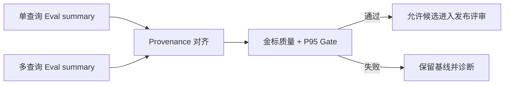

# 阶段三：RAG 离线对比评测与发布门槛

## 问题

多查询会提高候选覆盖，也会增加向量调用次数与 P95 时延。仅凭单元测试只能证明融合逻辑正确，不能证明对真实知识库的召回或排序质量有收益。因此发布前必须在同一金标数据、模型与 embedding 配置下，比较单查询基线与多查询候选。

## 实现

新增 `scripts/gate_rag_experiment.py`。它读取两个由 `scripts/run_agent_eval.py` 输出的脱敏聚合 summary，调用既有的 `compare_agent_eval.py` 进行 provenance 校验，然后执行以下 fail-closed 门槛：

| 检查 | 默认门槛 |
|---|---|
| 可比性 | dataset SHA-256、模型 Profile、embedding Profile、环境完全一致 |
| 金标量 | 两个运行均至少 100 个双人复核、已验证样本 |
| 质量 | verified Recall@3、MRR、nDCG@5 均不得低于单查询基线 |
| 时延 | 多查询 P95 不得比基线高出超过 10% |

任何缺少指标、样本不足或 provenance 不一致均为失败，不会被当成“未观察到回退”。报告只包含聚合数值与阈值，不输出问题、文档 ID、租户、Trace 或凭据。



## 运行方法

先在冻结的运行环境分别执行实验。`run_agent_eval.py` 已输出 `rag_ranking_verified` 指标；必须先走双人标注、`validate_rag_judgments.py` 和 `apply_rag_gold_labels.py`，不能把模型自评或未审核标签作为金标。

```bash
python3 scripts/gate_rag_experiment.py \
  --before /secure/eval/rag-single-query-summary.json \
  --after /secure/eval/rag-multi-query-summary.json \
  --output /secure/eval/rag-multi-query-gate.json \
  --min-verified 100 \
  --max-p95-regression 0.10
```

退出码 `0` 表示门槛通过；`3` 表示可读但未通过；`2` 表示输入或参数无效。真实 LLM Provider、金标语料和受控运行环境尚未提供，因此本阶段只验证了门槛程序和故障语义，未声称多查询已在生产语料上提升指标。

## 自动化验证

`scripts/test_gate_rag_experiment.py` 覆盖：可比且不回退的通过路径、质量回退、金标不足和 provenance 不一致。`make verify` 现将 Agent Eval、对比、标注与门槛脚本的确定性测试纳入离线质量门禁。
