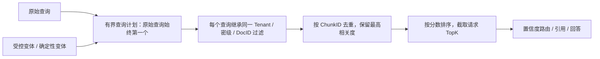

# 阶段二：RAG 多查询检索与融合设计验证

## 目标与边界

当问题表述模糊、包含流程性意图或调用方已完成查询改写时，单一向量查询容易遗漏术语不同但内容相关的文档。本阶段实现受控的多查询检索（Multi-Query Retrieval）：扩大召回面，但不放宽租户、密级、文档和来源过滤条件。

本阶段不将模型直接生成的文本视为可信检索条件，也不自动为所有请求调用 LLM。当前模型 Provider 的真实 E2E 尚未配置；因此平台先提供确定性、可测试的扩展器以及由上层 LLM/编排器填写 `QueryVariants` 的受控接口。后续接入 LLM 改写器时，必须使用结构化数组输出、长度/数量预算和同一评测集，不得绕开本模块。

## 检索链路



### 数据契约

`domain.RetrieveRequest` 新增：

- `QueryVariants []string`：上层已生成的互补改写；
- `EnableQueryExpansion bool`：允许本地确定性扩展。

`domain.RetrieveResponse` 新增：

- `QueryCount`：实际使用的有界查询数；
- `Expanded`：是否有扩展查询参与。

二者均为向后兼容字段。最多执行 4 个查询，始终保留原始查询，按 trim + 小写去重。Chat 对“怎么/如何/为什么/什么是”和问号类问题启用扩展；精确关键词请求保持单查询。`query_internal_docs` 工具同样启用此能力，保证显式知识库查询和 Chat 预取路径语义一致。

### 确定性扩展策略

当前仅对低风险、不会引入新实体的意图词做补充，例如：

| 原始问题 | 补充查询 |
|---|---|
| `服务下线告警怎么处理？` | `服务下线告警排查步骤 处置流程` |
| `接口超时为什么发生？` | `接口超时为什么发生 根因 排查` |
| `什么是任务完成率？` | `什么是任务完成率 定义 说明` |

对 `那个呢？` 这类缺少实体的指代不生成猜测性变体，应由对话上下文消解或向用户澄清。长查询（超过 80 个字符）也不做自动扩展，避免重复、成本放大和注入内容的再传播。

## 安全与失败不变量

1. 每个变体使用原请求的 `TenantID`、`DocIDs`、`MaxSecretLevel` 和 `ExcludeSources`；调用者不能借变体放宽权限。
2. 调用 Milvus 前清空 `QueryVariants`、关闭 `EnableQueryExpansion`，避免递归扩展和不可控 QPS。
3. 原始查询失败时，整个检索报错并走已有降级逻辑；不能以某个变体的偶然命中伪装正常链路。
4. 附加变体失败不会覆盖原查询的成功结果；其用途是提高召回，不能降低可用性。
5. 融合键优先是 `ChunkID`，同一 Chunk 多次命中仅保留最高得分；最后统一 TopK，防止查询数量放大上下文、Token 和引用数量。

## 验收与评测

自动测试覆盖：

- 原查询优先、空值/重复项去重和最多 4 条预算；
- 流程类问题的确定性扩展，以及无上下文指代不扩展；
- 多查询结果的去重、最高分保留、统一排序和 TopK；
- 所有变体继承同一租户及密级边界，且不会递归扩展；
- 原查询失败 fail-closed。

执行：

```bash
go test ./internal/rag ./internal/agent/chat ./internal/toolkit/adapters -count=1
go test ./... -count=1
python3 scripts/validate_baseline_artifacts.py
git diff --check
```

离线排名评测应对原始单查询与多查询分别计算 Recall@K、MRR、nDCG、引用正确率、P95 时延和平均查询数，并按照 `testdata/baseline/rag_quality_case.jsonl` 中的租户与注入负向 Case 保持安全回归。没有真实 Provider 与标注语料时，不得声称多查询提升了线上召回率。

## 后续优化

1. 接入受 schema 约束的 LLM Query Planner，写入 `QueryVariants`，且仅在低置信度、明确多意图或上下文指代可解析时触发。
2. 增加 BM25 与向量检索的混合召回，以及 RRF（Reciprocal Rank Fusion）；当前 Milvus 单库结果融合只合并多查询结果，不冒充混合检索。
3. 对融合候选增加 Cross-Encoder/LLM reranker，并固定候选预算、超时和降级行为。
4. 基于真实、脱敏的金标集设置“召回提升必须大于时延/成本增加”的发布门槛。
