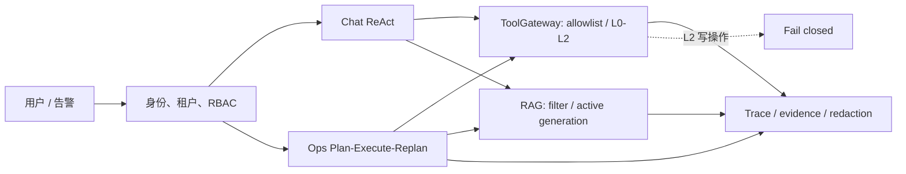

# 阶段零：Agent 平台能力基线与事实收敛

## 结论

截至 2026-08-17，WiseSentinel 已具备 Chat ReAct、Ops Plan-Execute-Replan、只读工具网关、RAG 代际发布/读侧围栏、Trace 证据与租户身份绑定等核心能力。阶段一新增的任务合同、`task_complete` 和取消写入围栏也已纳入本基线。

本结论不把“存在代码”误写为“生产可用”：默认配置没有外部 LLM 凭据，真实 Provider E2E 尚未验证；L2 写工具、沙箱执行器和长期记忆尚未实现。

## 事实优先级与状态

事实优先级为：运行时配置和可执行代码 > 自动化测试 > 数据库/迁移 > 设计文档。出现冲突时按更高优先级修正基线。

状态定义：

- `implemented`：代码与至少一个可定位测试均存在。
- `partial`：有受限实现，但关键闭环、覆盖面或环境验证缺失。
- `designed`：已有方案，尚无可运行实现。
- `not_implemented`：没有对应实现；不因规划存在而提升状态。

## 基线工件

工件位于 [`testdata/baseline`](/home/ubuntu/projects/WiseSentinel/testdata/baseline)：

- `capability_matrix.yaml`：能力状态、代码/测试证据、验收条件和缺口；文件采用 JSON 兼容 YAML，确保无需额外依赖即可校验。
- `agent_runtime_case.jsonl`：Chat/Ops 完成判定、取消、租约和真实模型验证用例。
- `tool_security_case.jsonl`：工具 allowlist、风险级别、MCP 约束、脱敏和租户边界用例。
- `rag_quality_case.jsonl`：RAG 访问隔离、代际发布、删除读围栏、GC 和注入防护用例。

每条 case 都有 `forbidden` 负向断言，避免仅验证“正常路径”。`manual` 和 `blocked` case 必须显式记录环境或覆盖缺口。

## 当前能力边界



运行时配置固定了 `chat_fast`、`ops_plan`、`ops_exec` 与 `embedding_default` profile，并为共享上游设置并发准入。当前配置中的 API key 和 base URL 留空，因此不能把模型调用成功率、工具遵从率或真实 RAG 回答质量列为自动化已验证。

工具配置已收敛为：L0 只读查询与时间工具、L1 日志/发布查询；L2 不存在可用安全执行器，网关必须拒绝。MCP 仅允许配置的绝对命令、参数、环境变量和预期工具集合。

## 验收与复核

每次能力变更都应同步更新矩阵、受影响 case 和本文件；不得在没有代码与测试证据时标为 `implemented`。运行：

```bash
python3 scripts/validate_baseline_artifacts.py
python3 scripts/test_validate_baseline_artifacts.py
go test ./...
```

带 `integration` 标签的用例需要显式提供 MySQL DSN，例如：

```bash
OPS_TEST_MYSQL_DSN='mysql:ws:ws123@tcp(127.0.0.1:3306)/wisesentinel?charset=utf8mb4&parseTime=True&loc=Local' \
go test -tags integration ./internal/repository -run 'TestOpsTask(LeaseCASAndBoundedRetry|ContractAndCancellationFence)Integration' -v
```

## 后续收敛项

1. 为隔离测试租户配置真实 LLM 凭据并运行可重复的 Provider E2E 评测，随后才可将 `LLM_E2E_EVAL` 升级。
2. 建立带角色、密级和 prompt-injection 语料的 RAG 集成评测集，关闭 `RQ-002`、`RQ-006` 缺口。
3. 在 L2 写工具上线前先实现审批绑定、资源级授权、幂等/补偿和隔离执行器；保持当前 fail-closed。
4. 如引入长期记忆，必须新增租户隔离、删除/遗忘、过期和敏感信息回归 case。

历史的认证修复审查记录保留在 `docs/quality/2026-08-10-阶段0-基线审查与认证修复.md`；它是时间点证据，不替代此处持续更新的当前事实基线。
