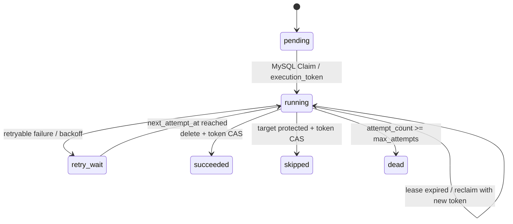

# 阶段 31：RAG GC Worker 与删除闭环

## 目标与风险

阶段 28–30 已将旧 generation 的清理意图写入 MySQL outbox，并提供 DB lease/CAS 原语，但没有实际消费者。文档删除仍在 API 请求内同步调用 Milvus：外部调用失败会令文档已不可读、但无可重试的物理清理记录。这一 crash/error window 会形成不可运维的向量残留。

本阶段目标是以企业级异步任务契约闭环物理清理：持久化意图、MySQL execution lease/token、指数退避/死信、删除前安全再校验和可重放的 Milvus 操作。读取安全仍由 document lifecycle 与 active generation resolver 立即保证；Milvus 物理删除是最终一致的，不将其表述为瞬时强一致。

## 根因与方案取舍

| 方案 | 结论 | 原因 |
| --- | --- | --- |
| API 内同步删除 Milvus | 淘汰 | 网络故障或进程崩溃会丢失补偿入口，并将外部可用性耦合到删除 API |
| Redis lock 作为 GC 正确性来源 | 淘汰 | Redis 过期/故障不能证明持久化所有权，不能围栏旧 worker |
| MySQL transactional outbox + DB lease/CAS | 采用 | 文档状态与清理意图原子提交；reclaim 后 token 能拒绝 stale completion |
| generation=0 视为历史向量 | 淘汰 | JSON 缺失字段并不等于数值零，可能误删新写入或漏删历史数据 |

## 落地实现

- 新增 `VectorGCRepo`：runnable 查询、DB Claim、token-owned terminal CAS、`retry_wait` 和 `dead` 状态；错误摘要通过 `redact.Summary` 投影，避免持久化上游敏感回显。
- 新增 `VectorGCWorker`：不使用 Redis；每次执行前检查：
  - `generation` 目标不得等于当前 active generation；
  - `legacy` 目标仅在 `legacy_allowed=false` 时执行；
  - `document_all` 仅在文档已删除/不存在时执行。
- 删除文档改为 `SoftDeleteAndEnqueueVectorGC`：`ws_document.status=deleted` 与 `document:all` outbox 在同一 MySQL transaction 提交。检索侧此前已经只解析 active document，因此提交后立即 fail-closed。
- 将 Worker 接入应用启动与 readiness (`vector_gc_worker`)；仅在完整 RAG/Milvus 可用时启动。
- `legacy` 清理先使用 `tenant_id + doc_id` 约束扫描，再从 JSON metadata 中识别**缺少** `generation` 的 chunk ID，最后按精确 ID 分批删除；扫描和删除分离，避免 offset 分页时因删除移位而漏删。
- 缺陷回归中发现 Milvus `Delete` 的 ACK 可能仍处于缓冲可见性窗口，紧跟的检索仍会返回旧 chunk；删除器现在在 ACK 后 `Flush`，Worker 仅在该 mutation 已持久化后写 success。
- 一个 worker 在 Milvus Delete 成功、终态 CAS 前崩溃时，lease 到期后会重放幂等删除；旧 token 无法覆盖新 owner 的结果。

## 状态与不变量



1. 所有 Milvus 删除都包含 tenant scope；generation 还必须包含 doc 与 generation。
2. active generation、仍允许的 legacy、active document 均不可被物理删除。
3. `execution_token` 不匹配时不能写入 success/retry/dead。
4. 文档删除 API 不等待外部向量库，且不会因其暂时不可用而丢失清理意图。

## 测试矩阵与回归证据

| 风险 | 用例 | 结果 |
| --- | --- | --- |
| stale worker 终态覆盖 | MySQL lease reclaim 后 token A/B 完成竞争 | 通过 |
| retry/backoff/dead | 两次 Claim，第一次进入 `retry_wait`，到期后第二次 dead-letter | 通过 |
| active generation 误删 | Worker safety gate 返回保护，断言不调用删除器且状态为 `skipped` | 通过 |
| target 精确性 | `document_all` 只调用 doc 删除器；generation 只调用代际删除器 | 通过 |
| 文档删除 crash window | soft delete 与 `document:all` outbox 同事务集成测试 | 通过 |
| legacy 精确清理 | 真实 Milvus 写入 legacy 向量，受限扫描+精确 ID 删除后检索无命中 | 通过 |
| 全量工程门禁 | `make verify` | 通过 |
| RAG 集成回归 | MySQL + Milvus：索引、增量重建、租户隔离、密级过滤 | 通过（分用例执行） |

执行证据：

```bash
make verify

OPS_TEST_MYSQL_DSN='mysql:ws:ws123@tcp(127.0.0.1:3306)/wisesentinel?charset=utf8mb4&parseTime=True&loc=Local' \
go test -tags=integration ./internal/repository \
  -run 'Test(VectorGC|SoftDeleteEnqueues|PublishEnqueues)' -count=1 -v

OPS_TEST_MYSQL_DSN='mysql:ws:ws123@tcp(127.0.0.1:3306)/wisesentinel?charset=utf8mb4&parseTime=True&loc=Local' \
go test -tags=integration ./internal/rag \
  -run '^TestSecretLevelFilter$' -count=1 -v
```

## 遗留风险与下一阶段门禁

- Milvus 没有服务器端 fencing；读侧安全已由 MySQL resolver 保证，物理 GC 仅最终一致。发布与删除在极端并发时可能产生一次幂等重放，但不会使非 active generation 对检索可见。
- `dead` 目前是可观测的持久化终态，尚未接入运营台重驱/告警；下一阶段应增加 dead-letter 指标、告警及受控人工重放 API（需要审批/审计）。
- legacy 大文档采用受限分页扫描；应为历史数据迁移设置容量阈值和运行指标，并在压测环境验证大量 chunk 的耗时与 Milvus Query 限额。
