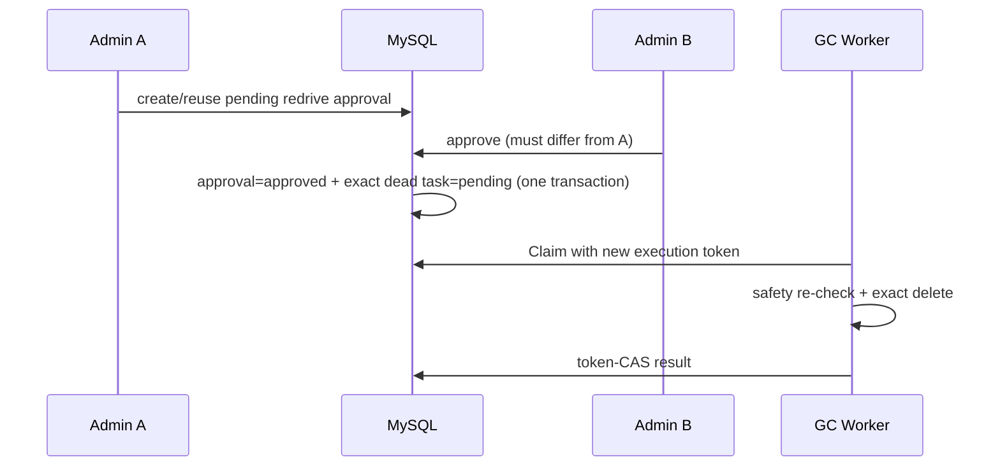

# 阶段 32：RAG GC 死信可观测与受控重驱

## 目标、根因与边界

阶段 31 已能把失败的向量清理持久化为 `dead`，但没有业务指标、告警、诊断 API 或安全的恢复通道。运维人员只能直连数据库，既无法及时发现积压，也无法证明重驱是谁发起、谁批准，且存在直接重放破坏性删除的风险。

本阶段将 `dead` 转为可运营能力。物理删除仍是最终一致的外部副作用；重驱只重新入队原始的、tenant/doc/target 精确任务，不会创建泛化删除请求。

## 企业级方案取舍

| 方案 | 结论 | 原因 |
| --- | --- | --- |
| 仅记录日志/数据库 `dead` | 淘汰 | 无告警、无队列趋势、无法在租户边界内安全诊断 |
| 管理 API 直接把 `dead` 改为 `pending` | 淘汰 | 单人可重新执行外部破坏操作，缺少职责分离 |
| Redis 审批/锁 | 淘汰 | 故障/过期会丢失审核意图，不能提供事务性 requeue |
| Prometheus 低基数指标 + DB 事务审批/requeue | 采用 | 全局运行态可告警，MySQL 作为审批、任务状态和重驱原子性的权威 |

## 实现

- 新增 `internal/observability` 公共 registry，避免后台 Worker 反向依赖 gateway：
  - `ws_rag_vector_gc_tasks{status}`：pending/running/retry_wait/succeeded/skipped/dead 的聚合快照；无 tenant/doc/error 标签，避免指标基数和敏感信息泄露。
  - `ws_rag_vector_gc_attempts_total{target_kind,outcome}`：succeeded/skipped/retry_wait/dead 的完成尝试。
- VectorGCWorker 每轮刷新队列快照，并仅在 token-owned 状态写成功后计数。
- Prometheus 新增 dead-letter（5 分钟）和 retry backlog（15 分钟）规则。
- 新增管理员 API：
  - `GET /api/v1/admin/vector-gc/tasks`：当前 JWT tenant 的任务诊断，错误字段再次脱敏投影。
  - `POST /api/v1/admin/vector-gc/documents/{doc_id}/tasks/{target_key}/redrive`：仅允许 `dead` task，创建 15 分钟审批；相同目标并发申请复用同一 pending approval。
- 批准路径复用 `ws_approval`，增加 `vector_gc_redrive` 专项事务：锁审批单和目标 task，验证 payload 的 tenant/doc/target、验证批准人不等于申请人，然后在同一 MySQL transaction 将审批置为 approved、原任务精确重置为 pending。批准重放或目标已改变会被拒绝。
- RBAC 沿用 `/api/v1/admin/*` 的 `sre_admin|platform_admin`，审计动作细分为 `vector_gc.read` 和 `vector_gc.redrive.request`；审批决定仍记录 `approval.decide`。



## 不变量与威胁模型

1. 只能重驱当前 tenant 内、仍为 `dead` 的精确 `(doc_id,target_key)`；不接收任意 Milvus expression。
2. 申请 payload 必须与服务器传入的 target/requester 一致；批准者必须与申请者不同。
3. 同一目标只有一个未过期 pending approval；已批准 approval 不可再次驱动状态变化。
4. approval 更新和 pending 重置要么一起提交，要么都不提交；任何 CAS 行数异常回滚事务。
5. 指标和 API 不携带 tenant、doc、token、原始上游错误或文档内容。

## 自动化测试与回归

| 风险 | 用例 | 结果 |
| --- | --- | --- |
| MySQL 空审批被误判系统异常 | 首次申请没有 pending approval | 先失败，显式处理 `sql.ErrNoRows` 后通过 |
| 并发重复申请 | 相同 target 第二次申请复用原 approval | 通过 |
| 自行批准 | requester=approver | 拒绝，通过 |
| 原子重驱 | 不同管理员批准后 task 变 pending、attempt=0、token 清空、审批 approved | 通过 |
| 审批重放 | 再次批准相同 approval | 不重驱，通过 |
| metrics 合约 | Registry 含 dead gauge 和 dead attempt counter | 通过 |
| 审计分类 | GET/POST Vector GC 路由映射独立 action | 通过 |

执行证据：

```bash
OPS_TEST_MYSQL_DSN='mysql:ws:ws123@tcp(127.0.0.1:3306)/wisesentinel?charset=utf8mb4&parseTime=True&loc=Local' \
go test -tags=integration ./internal/repository \
  -run 'Test(VectorGC|SoftDeleteEnqueues|PublishEnqueues)' -count=1 -v

make verify
```

## 遗留风险与下一阶段

- 当前重驱操作已有 REST 审批入口，但 Portal 尚未提供 dead-letter 队列、审批关联和告警跳转界面；前端阶段应实现只读诊断、申请确认和审批态反馈，禁止向浏览器暴露原始错误。
- 告警规则已落盘；部署环境仍需将 Alertmanager receiver、SLO 阈值和租户运营值班流程配置到实际环境。
- metrics 是进程内快照，服务重启后 counter 会重置（Prometheus rate 语义正常）；若要审计历史应查询 MySQL task/approval/audit 表，而非依赖 counter。
